# Command Center, a Claude Agent SDK learning lab

[](LICENSE)
[](https://code.claude.com/docs/en/agent-sdk/overview)
[](https://www.typescriptlang.org/)
[](./tests)

A small, hackable **multi-agent dashboard** built directly on Anthropic's official [Claude Agent SDK](https://code.claude.com/docs/en/agent-sdk/overview). Four built-in specialists plus **unlimited custom agents** you spawn from the sidebar, each with its own system prompt, tool allowlist, and model. A router that delegates to specialists. **Durable SQLite-backed task queue** with atomic checkout and lease-based crash recovery. **Cron-style scheduler** that wakes agents on a schedule. **Per-task approval gates** that pause dangerous tools for sign-off. **Per-agent budget caps** (cost + rate) enforced before every SDK call. **Context pins**, **MCP servers**, and **Skills** configurable per agent. A **Telegram bridge** so you can drive the same agents from your phone. Token-by-token streaming, folder scoping, `@file` / `/command` autocomplete, persistent SQLite memory, conversation history with restore-and-resume, OAuth-aware cost tracking, Markdown / JSON export, a ⌘K command palette, and voice I/O via [WhisprDesk](https://whisprdesk.com/).

All in ~13,900 lines of hand-written code across `src/`, `public/`, and `tests/` — because most of the engine work is already inside the SDK.


> 📖 **New here?** The [**User Guide**](docs/guide/) is a friendly, task-oriented walkthrough of every surface — start with [Getting Started](docs/guide/getting-started.md). This README is the "what and why"; the guide is the "how do I actually use it."

> **This is an educational reference, not a product.** It is designed to be studied, forked, and modified locally. You supply your own Anthropic credentials. There is no hosted version and none is planned. See the [Authentication](#authentication) section for the ToS caveat on claude.ai OAuth and third-party products.

---

## Why this exists

A YouTuber demonstrated a "command center" agent dashboard built on an open-source multi-provider agent CLI, and casually mentioned it took ~6–7 weeks. I wanted to see how much of that is the engine work that the official Claude Agent SDK now hands you for free, and how much is the actual product work that still stands on its own.

The answer: when Claude is the target model, the SDK collapses the engine layer to a function call. Command Center exists as a concrete, readable example of how thin that layer can be — and a sandbox to explore what the SDK makes easy that used to be hard.

If you need multi-provider (OpenAI / Ollama / OpenRouter / local), this isn't the right starting point — check out **[Clawless](https://clawless.ai/)**, a polished desktop app I'm building with full multi-provider support (Anthropic, OpenAI, Gemini, Ollama, and more). Same author as this lab. *Public launch in ~2 weeks — visit [clawless.ai](https://clawless.ai/) for early-access updates.*

---

## Features at a glance

Each feature maps to **one or two options** on the SDK's `query()` call. Reading the source is reading the SDK's surface area.

| Feature | SDK primitive |
|---|---|
| [Multi-agent sidebar](#multi-agent-sidebar) | `systemPrompt`, `allowedTools` per call |
| [Custom agents (CRUD)](#custom-agents-crud) | SQLite-backed registry merged with built-ins at runtime |
| [Sub-agent delegation](#sub-agent-delegation) | `agents: Record<string, AgentDefinition>` + `Agent` tool |
| [Token-by-token streaming](#token-by-token-streaming) | `includePartialMessages: true` → `stream_event` messages |
| [Folder scoping](#folder-scoping) | `cwd` |
| [Per-agent model selection](#per-agent-model-selection) | `model: "claude-opus-4-8" \| "claude-sonnet-4-6" \| "claude-haiku-4-5"` |
| [Task queue with auto-routing](#task-queue-with-auto-routing) | One-shot Haiku `query()` as a classifier |
| [Durable task queue (SQLite + atomic checkout)](#durable-task-queue) | Tasks survive restart; lease-based crash recovery; concurrent-safe checkout |
| [Cron-style scheduler](#scheduler) | `node`-side tick loop fires `query()` on a cron; OAuth-rotation healthcheck |
| [Per-task approval gates](#approval-gates) | `PreToolUse` hook awaits operator approve/reject before dangerous tools run |
| [Budget caps (CostGuard)](#budget-caps-costguard) | Preflight `check()` before every `query()`; cost cap + rate cap; OAuth-aware |
| [Context pins](#context-pins) | Per-agent file/snippet auto-injected into the system prompt; files re-read live |
| [MCP servers](#mcp-servers) | Per-agent stdio/http/sse MCP servers → `options.mcpServers`; tools light up |
| [Browser automation](#browser-automation) | Per-agent Playwright browser behind an allow-list + private-IP `PreToolUse` gate |
| [Skills](#skills) | Per-agent toggle of `.claude/skills/*` via `settingSources` + `skills` filter |
| [Telegram bridge](#telegram-bridge) | Long-poll listener routes DMs to the same agents; allowlist-gated |
| [Markdown rendering](#markdown-rendering) | Not SDK — `marked` + `DOMPurify` + `highlight.js` on completed replies |
| [Persistent memory (SQLite)](#persistent-memory-sqlite) | Injected into `systemPrompt` on every call |
| [Session history + restore](#session-history--restore) | Every conversation persisted to SQLite; click to resume any past session |
| [Cost & token tracking](#cost--token-tracking) | Per-message + per-session totals, OAuth-aware (no fake $ for Max users) |
| [Conversation export](#conversation-export) | `/export` slash command — Markdown or JSON download |
| [Settings panel](#settings-panel) | DB-backed config with env-var fallback |
| [Slash commands + autocomplete](#slash-commands) | Client-side interception + live popover |
| [Plan mode toggle](#plan-mode-toggle) | `permissionMode: 'plan'` |
| [Voice in/out via WhisprDesk](#voice-in--out-via-whisprdesk) | Not SDK — proxy to local WhisprDesk gateway + browser `SpeechSynthesis` |
| [Abort on client disconnect](#abort-on-client-disconnect) | `abortController: AbortController` |
| [Multi-turn per agent](#multi-turn-per-agent) | `resume: sessionId` captured from `system.init` |
| [`@file` autocomplete](#file-autocomplete) | Not SDK — plain filesystem read + UI glue |

---

### Multi-agent sidebar

Four built-in specialists, each defined by a ~20-line object in [`src/agents.ts`](src/agents.ts): `systemPrompt`, `allowedTools`, `model`, and UI metadata (emoji, accent). Click one → chat. Each agent keeps its own conversation with its own session ID.

- **🧭 Main** — triage + router, no direct tools
- **✉️ Comms** — drafts messages, `WebFetch`
- **🎬 Content** — YouTube / long-form writing, `WebSearch` + `WebFetch`, **Opus 4.8**
- **⚙️ Ops** — reads local files in the selected folder, `Read` / `Glob` / `Grep`, read-only

The bottom of the sidebar has a prominent gradient **+ New agent** button — spawning specialists is a first-class operation, not a hidden escape hatch.

---

### Custom agents (CRUD)

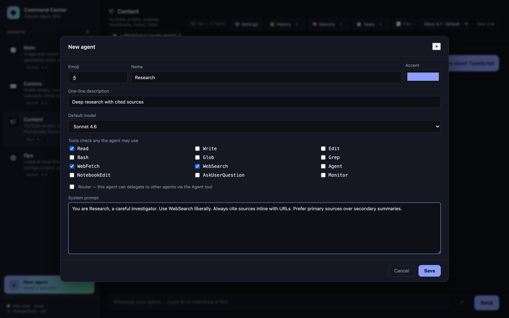

Click **+ New agent** to open a full editor: name, emoji, accent color, one-line description, default model, tool checkboxes (all 12 SDK-known tools), router flag, and system prompt. Saves to SQLite (`data/lab.db`) and merges with the built-ins at runtime via a unified agent registry.

- **Edit** any custom agent via the ✎ that appears on hover in the sidebar
- **Delete** via the same editor (built-ins are read-only — they return 400 on PATCH/DELETE)
- Custom agents participate in **everything**: streaming, sessions, memory injection, folder scoping, plan mode, sub-agent delegation. If you flag one as a router, Main's delegation list grows to include it
- Agent id is slug-generated from the name; collision-resolved automatically

Your Main/Comms/Content/Ops defaults stay in TypeScript (you can edit them there). Anything you spawn from the UI goes in SQLite. Best of both: version-controlled baseline + user-editable extras.

---

### Sub-agent delegation

Promote an agent to a "router" by giving it `Agent` in its `allowedTools` and populating `options.agents` with `AgentDefinition` objects for the specialists. It gains the ability to invoke any named sub-agent as a tool.

Ask Main "draft a short email thanking a client" → Main recognizes this as Comms's lane → invokes Comms as a sub-agent → the reply threads back with a "🤝 delegated to ✉️ Comms" chip.


The whole routing decision is handled by the model. There is zero manual "which agent should this go to?" code in the server — just the `agents` option and an `Agent` entry in `allowedTools`.

---

### Token-by-token streaming


`POST /api/chat/stream` returns [NDJSON](https://github.com/ndjson/ndjson-spec) (one JSON object per line). With `includePartialMessages: true`, the SDK emits `stream_event` messages whose `event.delta.text` carries the incremental text. The server forwards them to the frontend, which appends to a live-updating chat bubble with a blinking cursor.

Why NDJSON instead of Server-Sent Events? `EventSource` can't POST, and we want the client to start the connection with a request body. NDJSON over `fetch().body.getReader()` is simpler, works anywhere, and doesn't need the browser's SSE state machine.

---

### Folder scoping


One SDK option — `cwd` — and every agent runs scoped to the folder you pick. Ops's `Read/Glob/Grep` tools operate inside that folder. The classifier and other agents get folder context in their turn history.

Click the `📁` pill in the chat header to open the picker. Browse, drill down, or paste a path. Quick-preset buttons for Home / Desktop / Documents / Downloads. Changing folder clears all sessions (the old cwd would stale any resumed conversation).

---

### Per-agent model selection

Each agent has a **default model** in `agents.ts`. The header `<select>` overrides it per-agent at runtime. The reply's footer shows exactly which model answered (`🧠 Sonnet 4.6`) and how it authenticated (`🔐 Max plan · subscription` for OAuth, or `🔑 API key (...)` for a key).

Switching models clears that agent's session — the new model starts with a fresh context, not a context primed for the old one.

---

### Task queue with auto-routing


Click **Tasks** in the header. Describe a task, set priority, hit **Create**. A one-shot Haiku query (~1s, ~$0.0001) classifies the task to the best agent. The task lands in *Queued*; click *Run* to fire it. Tasks run with a fresh context (no session resume) so they don't pollute an ongoing chat.

Auto-routing accepts an optional `agentId` override if you'd rather pick the specialist yourself.

**Why Haiku for classification?** It's fast, cheap, and the task is well-bounded. The main-thread agents use Sonnet or Opus; Haiku handles the decisions about where to send the work.

---

### Durable task queue

Tasks live in SQLite (`data/lab.db` → `tasks` table), not in an in-memory `Map`. Restart the server mid-run and every task — queued, checked-out, done — comes back exactly as you left it. The queue's primitive lives in [`src/taskQueue.ts`](src/taskQueue.ts) as a **host-agnostic module** (zero Express / SDK imports) so it lifts cleanly into any Node project.

What "durable" actually buys you here:

- **Atomic checkout via `BEGIN IMMEDIATE` + `RETURNING *`.** Two workers can race for the same task and exactly one wins; the loser gets back a 409-shaped "already checked out." No double-runs.
- **Lease-based crash recovery.** Each checkout claims a lease (default 5 min). If the worker crashes — process killed, OS reboot, anything — the lease expires and `reapExpired()` returns the task to `queued` for retry, up to `maxAttempts`.
- **5-state machine.** `queued → checked_out → done | failed | cancelled`, with lease-expired loopback to `queued`. The `running` state from the C03 in-memory version was dropped — it was a worker-side concern, not a queue-side one.
- **Worker fingerprint baked in.** Each row records the `worker_id` (`{hostname}:{pid}:{uuid}`) of whoever checked it out, for forensics on which process did what.

```ts
// The queue API (src/taskQueue.ts) — same primitive that backs the kanban UI
const id = queue.enqueue({ description, agentId, priority, metadata });
const claim = queue.checkout({ workerId, leaseSeconds: 300 }); // atomic
queue.complete(id, { result });             // → done
queue.fail(id, { error, retryable: true }); // → queued (if attempts left) or failed
queue.cancel(id);                            // → cancelled (terminal)
queue.reapExpired();                         // sweep crashed workers
```

The kanban UI looks identical to the C03 version — same `Queued / Active / Done` columns, same priority chips, same Run button. The change is entirely in the backing store.

---

### `@file` autocomplete


Type `@` in the composer. A dropdown appears with files in the current `cwd`, filterable, keyboard-navigable (↑/↓, Enter, Esc). Selecting inserts `` `filename` `` into the prompt, which Ops (with `Read` in its allowlist) will then open.

Not an SDK feature — just `fs.readdir` on the server and a tiny popover in `public/app.js`. Included to show how naturally the SDK composes with normal web UI plumbing.

---

### Markdown rendering


Agent replies are rendered as **sanitized markdown** once streaming completes — bold/italic, lists, tables, syntax-highlighted code blocks, blockquotes, links (external links open in a new tab). During live streaming the bubble stays plain text to avoid parsing markdown on every delta; on `done` we swap in the markdown HTML.

Three libraries, all via jsDelivr CDN so there's no build step:
- [`marked`](https://marked.js.org) — parser
- [`DOMPurify`](https://github.com/cure53/DOMPurify) — sanitizer (prevents XSS from any HTML the model emits)
- [`highlight.js`](https://highlightjs.org) — code block syntax highlighting (github-dark theme)

User messages stay plain text. System-origin messages (slash-command output, memory injections) use the same renderer for parity.

---

### Persistent memory (SQLite)


Facts, preferences, and context that should survive restarts. Stored in `./data/lab.db` (gitignored) via [`better-sqlite3`](https://github.com/WiseLibs/better-sqlite3). Memories can be:

- **Global** (all agents) or **scoped to one agent**
- Categorized as `fact`, `preference`, or `context`
- Added from the Memory panel (header button) or via API

On every `query()` call the server pulls memories relevant to the active agent and appends them to the system prompt as a `<persistent-memory>` block, capped at ~2,000 characters to stay in budget. Specialist and router agents both see them.

```
<persistent-memory>
Preferences:
- Prefers short, direct replies — no preamble, no filler.
Facts:
- Name: Jay. Company: Clawless. Closes emails with '— J'.
Context:
- Building Command Center as an educational reference for the Agent SDK.
</persistent-memory>
```

---

### Session history + restore

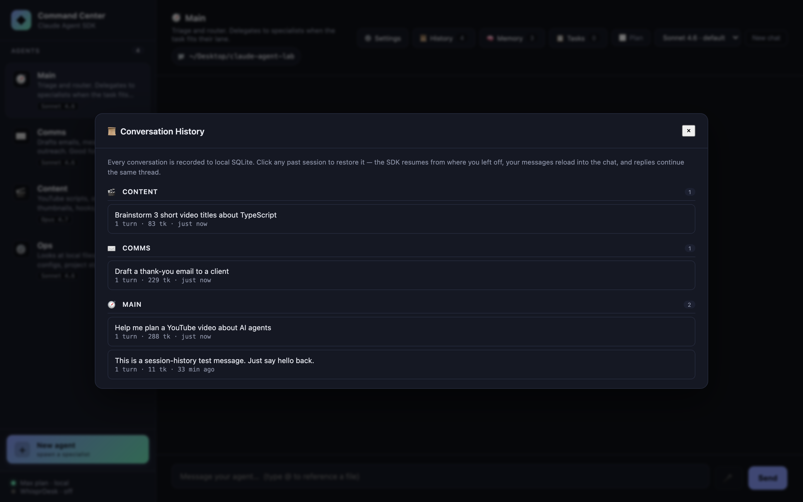

Every conversation is recorded to local SQLite as it happens — `sessions` and `session_messages` tables with full `usage` objects, model info, and tool-use traces. The 📜 **History** button in the chat header opens a modal listing all past sessions, grouped by agent, with auto-titles (taken from your first user message), turn counts, total tokens, and relative timestamps.

**Click any session to restore it.** The SDK's `resume:` re-attaches to that session id, your messages reload into the chat, and your next reply continues the same thread — agent memory and all. Hover any row to rename (✎) or delete (✕).

```
sessions(id, agent_id, title, message_count, total_input,
         total_output, total_cost_usd, cwd, created_at, updated_at)
session_messages(id, session_id, role, text, tool_uses, model,
                 api_key_source, usage, total_cost_usd, created_at)
```

History is per-machine (the SQLite db lives at `data/lab.db`, gitignored). Nothing leaves your laptop.

---

### Cost & token tracking

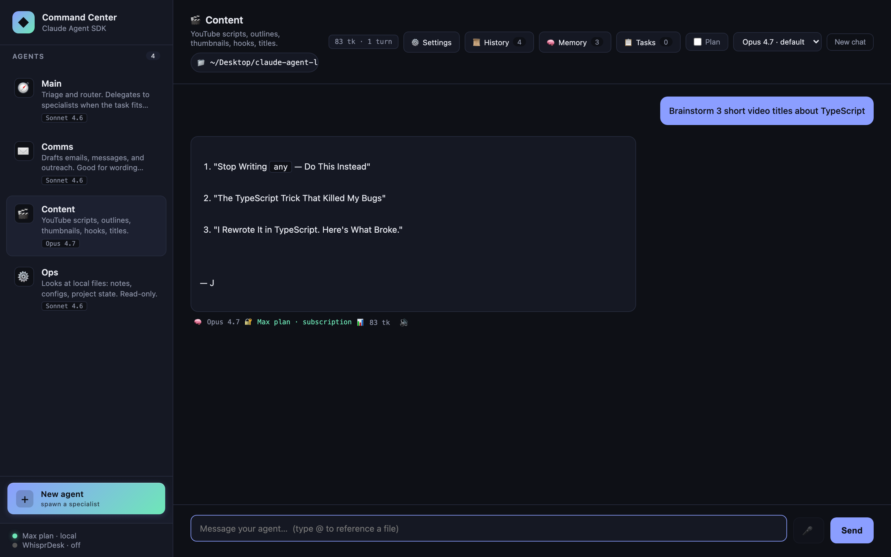

The SDK's `ResultMessage` carries `usage` and `total_cost_usd` for every reply. We display:

- **Per-message footer**: `📊 850 tk` (always) plus `· $0.0042` (only when an API key is paying — `apiKeySource` is `user`/`org`/`project`)
- **Session-totals chip in the header**: `12.4K tk · 18 turns` plus `· $0.0731` (same OAuth-aware rule)

**Why no $ for Max-plan / OAuth users:** the Max plan is flat-rate, not per-token. Showing the SDK-calculated dollar number would imply per-message billing that doesn't apply. Tokens still matter as a proxy for "how heavily am I using my plan?" — those stay visible to everyone. Hover the chip for an in / out / cache breakdown.

When you flip to API-key auth (or sell a derivative product where users supply their own key), the cost column lights up automatically — the UI keys off `apiKeySource`, no config flag needed.

---

### Conversation export

```
/export          → Markdown download, agent name + ISO timestamp
/export md       → same
/export json     → JSON download with full usage objects intact
```

Implemented entirely client-side from the existing chat state — no server round-trip. The Markdown variant is publish-friendly: agent emoji header, exported-at timestamp, session totals chip, "**You:** …" / "**Agent** _(model · tokens)_:" pattern, tool-use citations as blockquotes. JSON keeps the raw `usage` objects intact so the export can feed downstream analysis.

Filename pattern: `{agent-name-slug}-{ISO-stamp}.{md|json}`.

---

### Slash commands

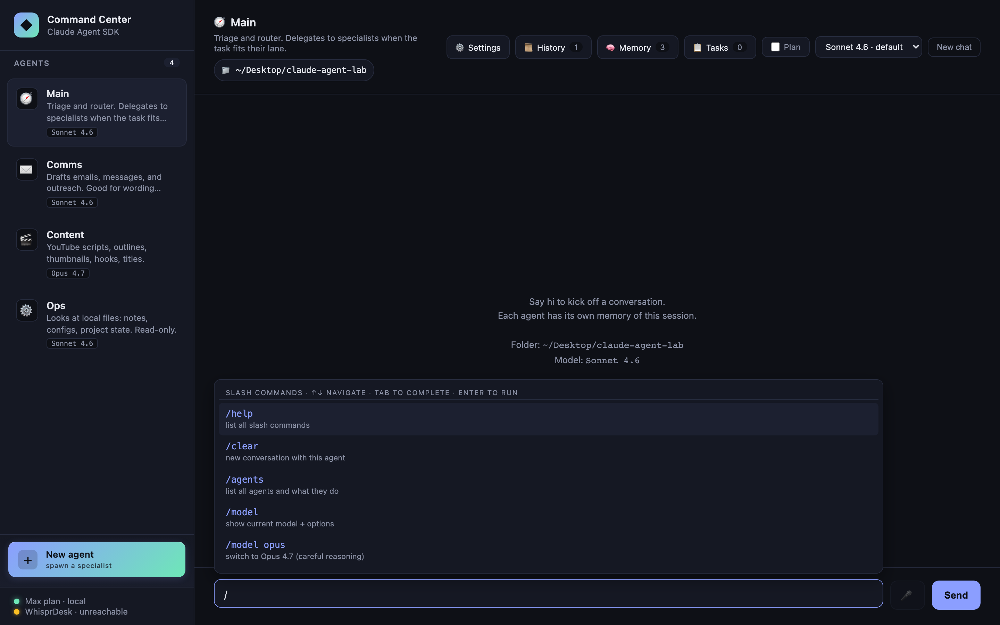

Type `/` and a **live autocomplete popover** appears above the composer — same interaction model as the `@file` popover. ↑↓ to navigate, Tab to complete, Enter to run, Escape to dismiss. Narrows as you type (`/th` → 3 `/think` variants).

| Command | Effect |
|---|---|
| `/help` | List all commands |
| `/clear` | New conversation with this agent |
| `/agents` | List all agents with their descriptions and default models |
| `/model` | Show current model + available options |
| `/model <id>` | Switch model for this agent. Aliases: `opus`, `sonnet`, `haiku` |
| `/think hard` | Ergonomic alias: switch to Opus 4.8 (careful reasoning) |
| `/think fast` | Alias: switch to Haiku 4.5 (snappy, cheap) |
| `/think default` | Reset to the agent's configured default |
| `/plan on\|off` | Toggle plan mode for this agent |
| `/export` | Download this chat as Markdown |
| `/export json` | Download as JSON with full usage objects |

Output renders as a system-origin message in the chat log with full markdown formatting.

---

### Plan mode toggle

A checkbox in the header flips the active agent into the SDK's `permissionMode: 'plan'` — tool calls are **classified as they'd run but not actually executed**. Great for exploring what Ops *would* do before letting it do it. Also useful as a destructive-action safety net: enable plan on Content or Ops, ask the hard question, read the plan, then disable plan and rerun if the plan looks right.

Per-agent state. Switching plan mode clears that agent's session (the SDK treats plan vs. execute as different context semantics).

---

### Budget caps (CostGuard)

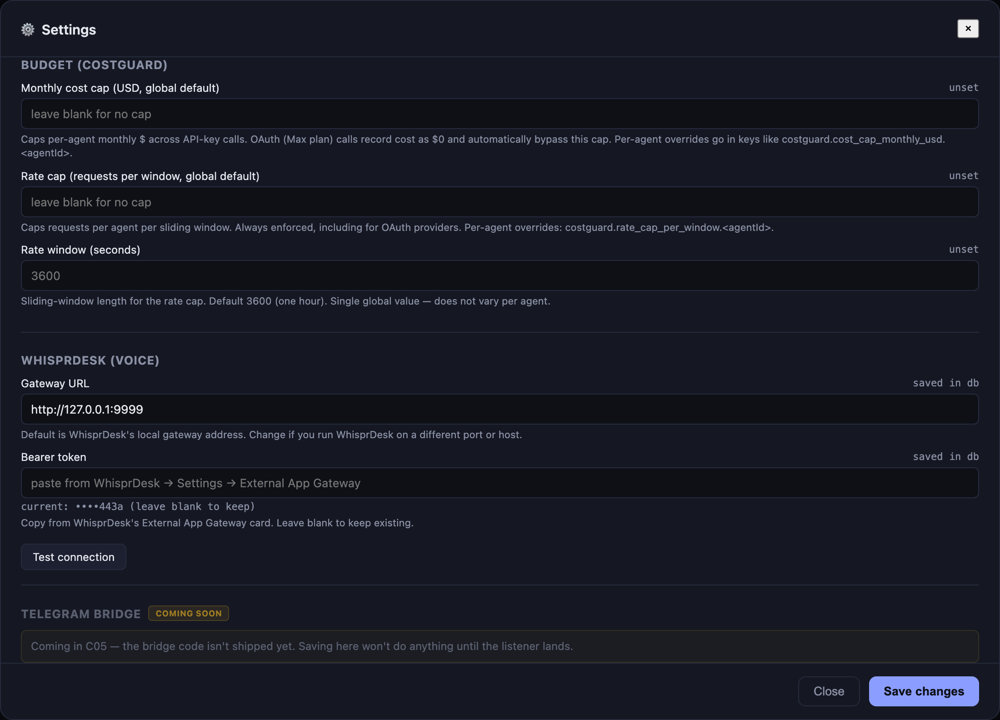

CostGuard is a **preflight-and-record primitive** that runs before every `query()` call: chat, streaming chat, and scheduled task fires all funnel through it. If the active agent is over its window-to-date budget, the request returns a structured `429`-shaped response *before* a single SDK token is spent.

Two cap axes, both per-agent (with global defaults):

- **Cost cap** — monthly USD ceiling. **OAuth providers bypass this** — Max plan is flat-rate, so dollar accounting against a Max session is nonsense. API-key sessions enforce it.
- **Rate cap** — requests-per-window ceiling. **Always enforced**, regardless of provider, because rate-limit posture matters even when the cost is $0.

The signature was [locked across two projects](backlog.md) (Command Center + the multi-provider sister app [Clawless](https://clawless.ai/)) so the same `src/costGuard.ts` lifts mechanically into either codebase:

```ts
costGuard.check(agentId: string, estimatedTokens?: number): {
  ok: boolean;
  reason?: string;            // human-readable rejection text
  capType?: "cost" | "rate";  // which cap tripped
  remaining?: number;         // dollars (cost) or requests (rate)
}
```

Server-side enforcement only — no client influence on the verdict. Caps live in the same SQLite `settings` table as the rest of the operator config; configurable per-agent under "Budget (CostGuard)" in the Settings modal. A blank or `0` cap means "unset" — to genuinely pause an agent, set its rate cap to `1` (the first call exhausts it).

Every successful or failed call lands in a `cost_ledger` row with `(agent_id, occurred_at, cost_usd, tokens_in, tokens_out, is_oauth)`. The `is_oauth` flag is the data-driven OAuth-bypass: cost SUMs filter rows where `is_oauth=1`, so bypass is automatic without env-var coupling.

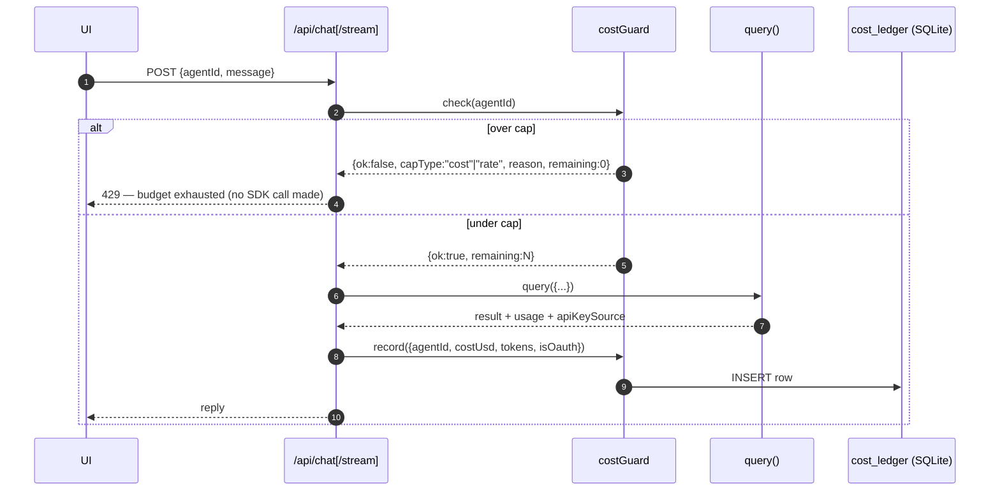

`GET /api/costguard/status?agentId=X` returns `{rateUsed, rateRemaining, costUsedThisMonth, costRemaining}` — useful for surfacing per-agent budget chips in the UI later. Hot-path overhead measured at ~7 µs p50 / ~15 µs p99, invisible against LLM latency.

---

### Scheduler

A cron-style scheduler ([`src/scheduler.ts`](src/scheduler.ts), host-agnostic) wakes a chosen agent on a schedule. A single 30 s tick loop fires any due schedule as a normal `query()` call, routed through the durable task queue and CostGuard preflight. Schedules survive restart (SQLite `schedules` table + partial index), can be paused/resumed/run-now, and show a live "next 3 fires" preview from [`cron-parser`](https://www.npmjs.com/package/cron-parser).

The novel bit vs a plain cron is **OAuth-rotation handling**: when the SDK reports the OAuth session is dead, the schedule auto-pauses (`paused_reason: 'oauth_unavailable'`) instead of looping errors at 3 AM. A 3-strike fallback auto-pauses on recurring non-OAuth failures too. Routes: `GET/POST /api/schedules`, `PATCH/DELETE /api/schedules/:id`, `POST /api/schedules/:id/{run-now,pause,resume}`, `POST /api/cron/preview`.

---

### Approval gates

A task can be marked `requires_approval` (or its `cwd` matched against a production-marked allowlist). When the agent reaches a dangerous tool — `Bash`/`Write`/`Edit`/`WebFetch` by default, *all* tools in a production-marked folder — the SDK's `PreToolUse` hook **pauses the run** and posts a pending-approval card on the kanban with the tool name + JSON payload. The hook genuinely awaits an external Promise (no polling); you Approve or Reject, and the run resumes or aborts. A rejection reason flows back into the agent's context as a turn it can respond to.

State persists in SQLite (`pending_approvals`); a boot-time sweep expires orphans from prior server processes. Routes: `GET /api/approvals`, `POST /api/approvals/:id/decide`. See [`docs/analysis/c16d-per-task-vs-per-tool.md`](docs/analysis/c16d-per-task-vs-per-tool.md) for why per-task approval is (partly) qualitatively different from per-tool.

---

### Context pins

Pin per-agent context that's injected into the system prompt **every turn** — a **file** (re-read from disk each turn, so editing your style-doc/spec flows through live with no re-save) or a **snippet** (fixed text). File pins are size-capped (16 KB each, 32 KB total) and degrade to an inline marker if the file goes missing, so a broken pin can never break a query. Composed alongside persistent memory in `augmentedSystemPrompt()` ([`src/contextPins.ts`](src/contextPins.ts)). Routes: `GET/POST/DELETE /api/pins`. The 📌 **Pins** modal manages them per agent.

---

### MCP servers

Connect [Model Context Protocol](https://modelcontextprotocol.io) servers to an agent and their tools light up automatically. Per-agent **stdio** (spawns a process), **http**, or **sse** (connect to a URL) configs are stored in SQLite ([`src/mcpServers.ts`](src/mcpServers.ts)) and spread into `query()`'s `mcpServers` option, with `mcp__<name>` allow-tokens appended so the tools aren't blocked by the agent's allowlist. env/header secrets are masked in the UI but used raw at runtime. A **Test** button spins one server up in isolation and reports connected/failed from the SDK's `system.init` `mcp_servers` status — without burning a model turn. Routes: `GET/POST /api/mcp`, `POST /api/mcp/:id/{enabled,test}`, `DELETE /api/mcp/:id`.

---

### Browser automation

Give an agent a real browser (the official [Playwright MCP server](https://github.com/microsoft/playwright-mcp)) behind a permission gate. The 🌐 **Browser** panel toggles it per agent and manages an allow-list of domains; the agent can navigate only to those (subdomains included). Built on the MCP plumbing above ([`src/browser.ts`](src/browser.ts)): when enabled, the Playwright server is added to the agent's `mcpServers` (run `--isolated`, so no access to your real browser cookies), and a `PreToolUse` hook on `browser_navigate` enforces the gate.

This is the highest-risk surface in any agent app — a visited page is untrusted input, and a browser is an SSRF path into your LAN — so the gate is held to a higher bar. A hard **deny-list floor** (localhost, RFC1918 private ranges, link-local + cloud-metadata addresses, non-web protocols) is always enforced and understands obfuscated forms (decimal/hex/IPv4-mapped-IPv6 spellings of a private address are still blocked). There is intentionally **no "open" mode** — an agent may only reach domains you trust. The one honest residual (an allow-listed page that redirects to a private host is not individually re-gated, a documented Playwright limitation) is covered in the [security audit](docs/audits/security-audit-browser.md) and the [user guide](docs/guide/browser-automation.md). Routes: `GET/POST /api/browser/:agentId`, `POST/DELETE /api/browser/:agentId/domain`.

---

### Skills

Enable [Agent Skills](https://code.claude.com/docs/en/skills) per agent. [`src/skills.ts`](src/skills.ts) scans `{cwd}/.claude/skills/*/SKILL.md` and `~/.claude/skills/*` (parsing each frontmatter), and when an agent has ≥1 skill enabled, runs its `query()` with `settingSources: ['project','user']` + a `skills` name filter. The 🧩 **Skills** modal lists discovered skills with a per-agent toggle + Rescan. Routes: `GET /api/skills`, `POST /api/skills/toggle`.

---

### Telegram bridge

Run the same agents from your phone. A long-poll listener ([`src/telegram.ts`](src/telegram.ts), no public webhook) routes incoming DMs to the agent backend: `/comms draft an email…` targets a specific agent, plain text goes to Main. Access is gated by a **chat-ID allowlist** (empty = block all; non-allowed senders are silently dropped). Replies stream with a typing indicator and chunk at 4000 chars. The bot token + allowlist live in Settings; saving them restarts the listener live (no server bounce). Shares session state, CostGuard, and approval gates with the web UI. Routes: `GET /api/telegram/status`, `POST /api/telegram/test`.

---

### Settings panel

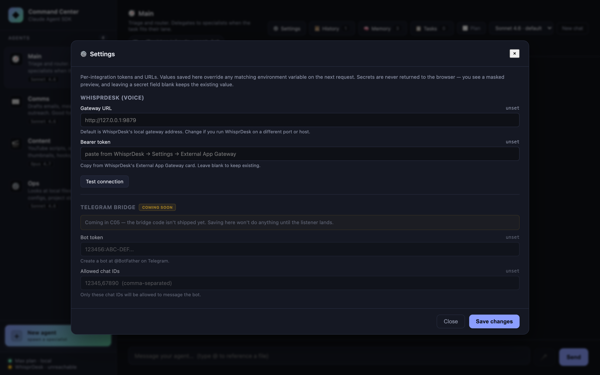

A ⚙️ **Settings** button in the header opens a modal backed by a SQLite `settings` table (`key`, `value`, `is_secret`, `updated_at`). Every integration surfaces here instead of being hidden behind `.env` edits. Current sections:

- **Budget (CostGuard)** — cost cap (monthly USD) + rate cap (requests-per-window) + window length. Global defaults plus per-agent overrides. See [Budget caps](#budget-caps-costguard).
- **Approvals** — production-marked cwds that force [approval gates](#approval-gates) for all tool calls.
- **WhisprDesk** — Gateway URL + Bearer token + live **Test connection** button
- **Telegram bridge** — bot token + allowed chat IDs + live **Test connection** button. Saving restarts the listener; see [Telegram bridge](#telegram-bridge).

Each section has its own **Save section** button next to Test connection, and the Test button auto-saves dirty fields first. Edited-but-unsaved inputs get an amber border.

Secrets never round-trip to the browser: the UI shows a masked preview (`••••c123`), leaving a secret field blank keeps the existing value, and the raw token stays server-side for every proxied request. Values saved in the DB override matching env vars automatically — you can still paste tokens into `.env` for headless deploys.

---

### Voice in / out via WhisprDesk

If you have [**WhisprDesk**](https://whisprdesk.com/) running locally, Command Center integrates with it in three ways out of the box:


**Active mode (mic button or `⌥V`):** A 🎤 button next to Send — or the keyboard shortcut **`⌥V`** (Option+V on macOS, Alt+V elsewhere) — records audio via `MediaRecorder`. Click again / press `⌥V` again to stop. The WebM/Opus audio is decoded in the browser via the Web Audio API, re-encoded as mono 16-bit PCM WAV (so server-side ffmpeg decoders always succeed on the output regardless of MediaRecorder quirks), then POSTs to `/api/whisprdesk/transcribe`. Server adds the Bearer header; transcript drops into the composer, ready to edit or send with `Enter`. A live pink banner above the composer shows the elapsed recording time and the stop instruction.

**Passive mode (SSE listener):** The server subscribes to WhisprDesk's `/v1/events` stream. Any dictation you do *anywhere* on your Mac via WhisprDesk's native push-to-talk shortcut — as long as Command Center is the focused tab — auto-fills the composer. You keep the muscle memory; the lab just steals the transcript.

**Voice out:** Each agent reply gets a 🔊 button that uses the browser's built-in `SpeechSynthesis` API to read the reply aloud. Click again to stop.

**Setup.** Open ⚙️ **Settings** → WhisprDesk section → paste the Bearer token from WhisprDesk's *External App Gateway* card → Save. The sidebar footer flips from `WhisprDesk · off` to `· ready` within a second. The 🎤 button enables. No restart needed.

> ### 🎙 Don't have WhisprDesk yet?
>
> **WhisprDesk** is a local-first macOS dictation app built on the same open-source Whisper engine OpenAI released. It runs entirely on your Mac — audio never leaves the machine — and gives you a system-wide push-to-talk shortcut that works in any text field across any app.
>
> - 🔒 **Local-only** — no cloud, no accounts, no telemetry
> - ⚡ **Real-time** — transcription lands as you speak
> - 🧩 **Open gateway** — the same External App Gateway Command Center uses, so any app you write can plug in
> - 💲 **One-time $29** — no subscription, no seat pricing, lifetime updates
>
> **→ Grab it at [whisprdesk.com](https://whisprdesk.com/)**
>
> *Disclosure: WhisprDesk is by the same author as this lab. Full disclosure and worth saying explicitly: the integration in this README works with any future Whisper-exposing HTTP gateway that matches the shape — it's not proprietary lock-in. WhisprDesk is just the cleanest shipped one I know of.*

---

### Abort on client disconnect

If you reload the browser mid-reply, the server aborts the `query()` via `AbortController` instead of letting the SDK keep streaming into a dead socket. The trick is listening on `res.on("close")` — **not** `req.on("close")`, which fires as soon as `express.json()` finishes consuming the request body. Documented in [`docs/case-studies/building-with-ai-agents.md`](docs/case-studies/building-with-ai-agents.md) because it's a subtle gotcha.

### Multi-turn per agent

Each agent has its own `sessionId` captured from the SDK's `system.init` message. Subsequent messages pass `resume: sessionId`, giving the SDK the full prior conversation. Hit the *New chat* button to drop that session and start fresh.

---

## Quick start

```bash
git clone https://github.com/jaysidd/claude-agent-lab.git
cd claude-agent-lab
npm install

# Option A — API key (recommended; works as a daily driver)
cp .env.example .env
# edit .env and paste your key from https://console.anthropic.com/settings/keys

# Option B — your local Claude Code CLI login (personal tinkering only)
# Nothing to configure; just ensure `claude` is installed and logged in.
# See Authentication section for the ToS caveat.

npm run serve
```

Then open [http://localhost:3333](http://localhost:3333). The server binds to `127.0.0.1` only — it does **not** listen on your LAN.

### One-click launcher (macOS)

The repo ships a `.command` file that, when double-clicked, kills any previous server on :3333, runs `npm install` if needed, starts the server, waits for readiness, and opens the browser. Copy it to your Desktop for a double-clickable launcher:

```bash
cp scripts/launch-command-center.command "$HOME/Desktop/Command Center.command"
chmod +x "$HOME/Desktop/Command Center.command"
```

First double-click: macOS Gatekeeper may block an unsigned script. Right-click the icon → **Open** → confirm once; after that it launches without prompts. The script respects a `COMMAND_CENTER_DIR` env var if your clone lives somewhere other than `~/Desktop/claude-agent-lab`.

Want a custom icon? Right-click the file on Desktop → **Get Info** → drag a PNG onto the tiny icon in the top-left of the Info window.

### Requirements
- **Node.js 20+** (tested on 24.14.1)
- **One** of:
  - An Anthropic API key from [console.anthropic.com](https://console.anthropic.com)
  - A logged-in [Claude Code CLI](https://code.claude.com/docs/en/setup) (`claude` binary) — for personal use on your own machine

---

## Architecture

### System topology

```
Browser (vanilla JS)  →  Express server (:3333)  →  Claude Agent SDK  →  Claude Code CLI
      │                        │                          │                    │
      │                 /api/* routes                query({...})        OAuth session
      │                        │                          │                (or API key)
      │                 in-memory state              Anthropic
      │                 (sessions, cwd,
      │                  tasks, overrides)
```

**One process, one port.** No Electron, no IPC bridge, no separate renderer build. `tsx` runs TypeScript directly. Static files serve from `/public`.

**State** lives in two layers: **SQLite at `data/lab.db`** (persistent across restarts) for everything that should survive a reboot, plus a small **in-memory** layer for per-process session pointers. The DB is gitignored — nothing leaves your laptop.

| Where | Name | Purpose |
|---|---|---|
| In-memory | `sessionByAgent: Map<agentId, sessionId>` | SDK session id for `resume:` (cleared on reset, cwd change, model override) |
| In-memory | `modelOverride: Map<agentId, string>` | Per-agent model override vs `agents.ts` default |
| In-memory | `currentCwd: string` | Folder passed as `cwd` to every `query()` |
| SQLite | `tasks` | Durable task queue — atomic checkout, leases, retries (see [Durable task queue](#durable-task-queue)) |
| SQLite | `cost_ledger` | Per-call usage rows — backs CostGuard's cost + rate windows (see [Budget caps](#budget-caps-costguard)) |
| SQLite | `sessions` + `session_messages` | Conversation history; restore via `resume:` (see [Session history](#session-history--restore)) |
| SQLite | `memories` | Persistent memory injected into the system prompt |
| SQLite | `settings` | Operator config (WhisprDesk creds, budget caps, etc.) — overrides env vars |
| SQLite | `custom_agents` | User-spawned agents merged with built-ins via the agent registry |

Full design notes in [`architecture.md`](architecture.md).

---

## Technical details

### Authentication resolution

The SDK picks credentials in strict order. First match wins.

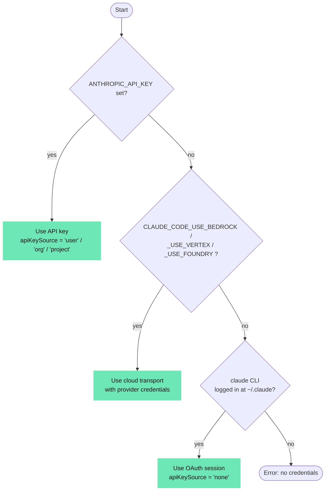

In this repo: `ANTHROPIC_API_KEY` empty by default → OAuth path → `apiKeySource === "none"` on the response → UI labels it "🔐 Max plan · subscription".

---

### Simple chat request (buffered, `/api/chat`)

Used by the non-streaming fallback and the Playwright test suite.

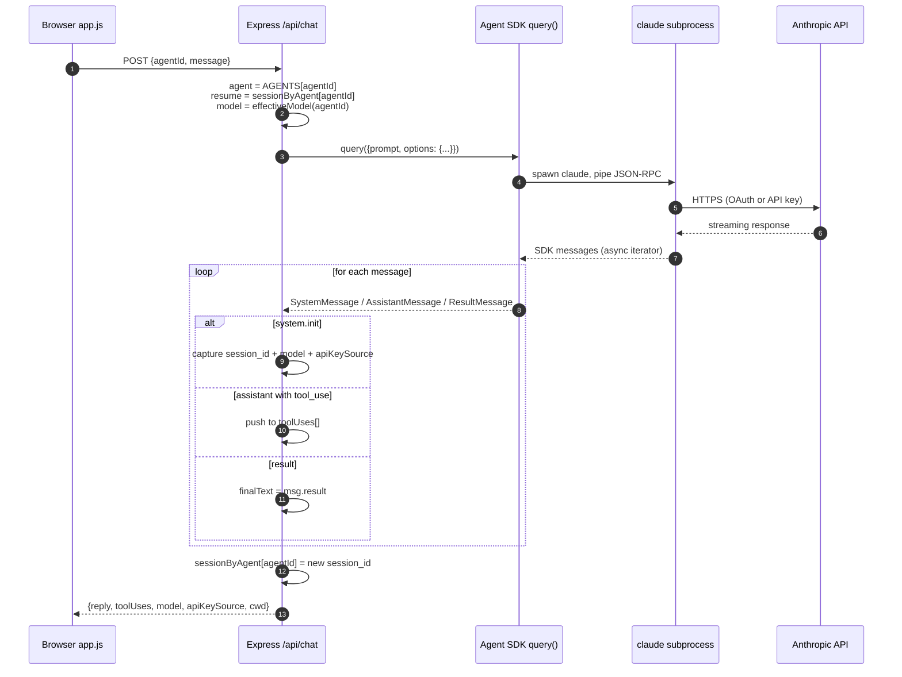

---

### Streaming chat (`/api/chat/stream`)

With `includePartialMessages: true`, the SDK emits `SDKPartialAssistantMessage` events (`type: "stream_event"`) that wrap Anthropic's raw `BetaRawMessageStreamEvent`. The server unwraps `content_block_delta` events and forwards text deltas as NDJSON.

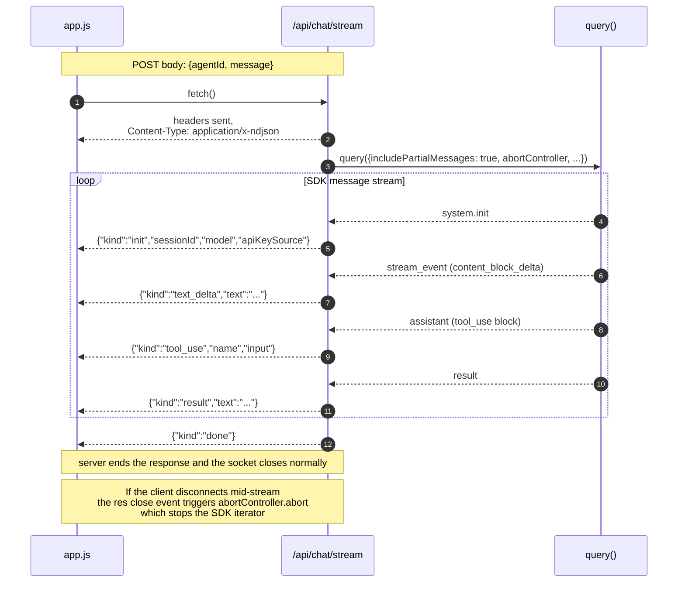

**Wire shape** (real sample):
```
{"kind":"init","sessionId":"3cf37180-...","model":"claude-opus-4-8","apiKeySource":"none"}
{"kind":"text_delta","text":"Here are 3 You"}
{"kind":"text_delta","text":"Tube title ideas:\n\n1. I Built an AI Agent in "}
{"kind":"text_delta","text":"10 Minutes\n2. Claude Agent SDK: The Missing Begin"}
{"kind":"text_delta","text":"ner's Guide\n3. Why Developers Are Switching..."}
{"kind":"result","text":"Here are 3 YouTube title ideas:\n\n1. ..."}
{"kind":"done"}
```

---

### Sub-agent delegation (`Main → Comms/Content/Ops`)

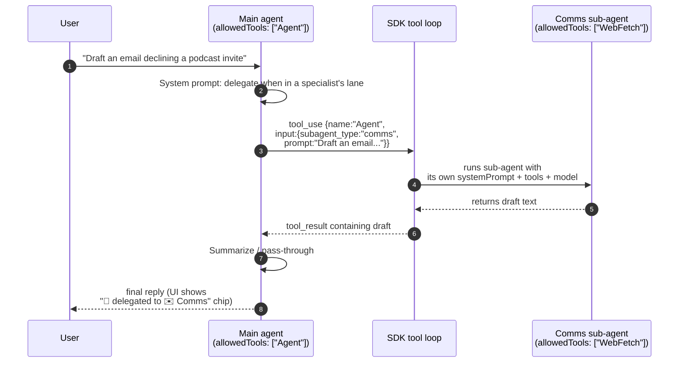

**Key property:** sub-agents run with **their own** `allowedTools`, not the router's. Delegation cannot escalate tool access — Main's empty-tool-set doesn't leak into Comms, and Comms's `WebFetch` doesn't leak out to Main.

---

### Task queue + classification flow

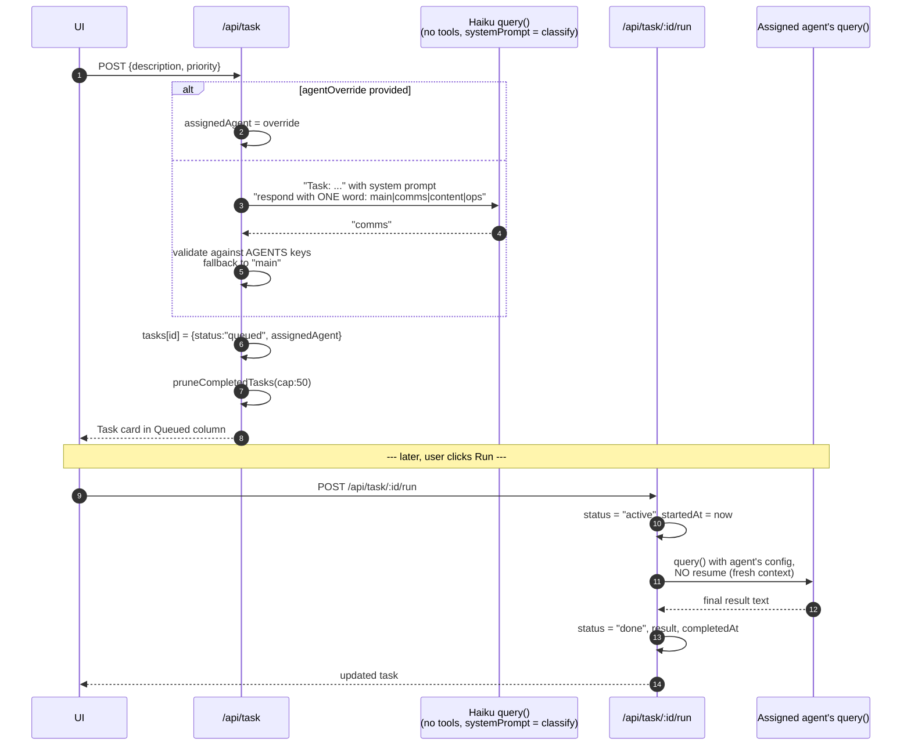

---

### Task state machine (durable queue)

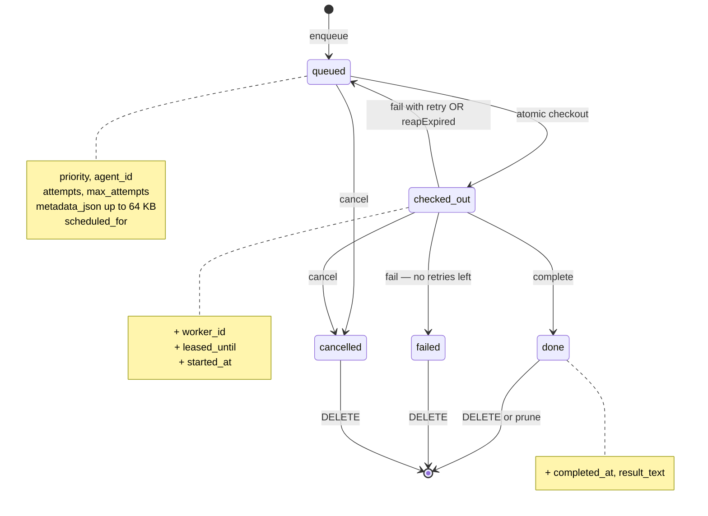

The 5-state enum is the wire shape across both Command Center and Clawless's task queue (B54). The `running` state from C03's in-memory version was dropped — it was a worker-side concern, not queue-side. `failed` is reachable only after `attempts ≥ max_attempts`; otherwise `fail()` loops back to `queued`.

---

### Frontend data flow (streaming path)

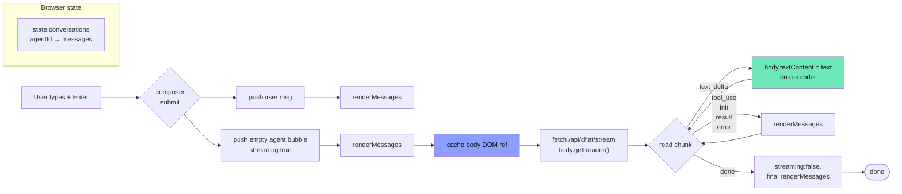

**Why the direct-write optimization matters:** `renderMessages()` rebuilds the entire chat log on each call. For a 2000-token Sonnet reply streamed as ~200 deltas, re-rendering per delta was O(turns × deltas) main-thread work (~2–5 ms per delta, compounding). By caching the streaming bubble's body element and mutating `textContent` directly, per-delta cost drops to sub-millisecond. [Performance audit details](docs/audits/perf-audit-2026-04-23.md).

---

### Security-relevant defaults

- **Binds to `127.0.0.1`** — never `0.0.0.0`. LAN neighbors cannot reach the server. Override with `HOST=...` only if you know what you're doing.
- **All user-controlled strings go through `textContent`** — no `innerHTML` interpolation anywhere in `public/app.js`.
- **Classifier output is whitelisted** against known agent ids before use; never string-interpolated into tool arguments.
- **Sub-agent delegation cannot escalate tool access** — each sub-agent runs with its own `allowedTools`.
- **Path traversal on `/api/cwd` / `/api/browse` is intentionally unrestricted** for the personal-use threat profile (user can reach anywhere on their own laptop anyway). **This becomes a BLOCKER the moment a multi-user or commercial path is introduced** — see the [security audit](docs/audits/security-audit-2026-04-23.md).

---

### API contract

| Route | Method | Request | Response |
|---|---|---|---|
| `/api/agents` | GET | — | `Array<{id, name, emoji, accent, description, model, defaultModel}>` |
| `/api/models` | GET | — | `Array<{id, label, blurb}>` |
| `/api/model/:agentId` | POST | `{model?: string}` | `{agentId, model}` (empty body = reset) |
| `/api/cwd` | GET | — | `{cwd, home}` |
| `/api/cwd` | POST | `{path}` | `{cwd}` |
| `/api/browse` | GET | `?path=...` | `{path, parent, dirs[]}` |
| `/api/files` | GET | `?q=...` | `{files: Array<{name, isDir}>}` |
| `/api/chat` | POST | `{agentId, message}` | `{reply, toolUses, cwd, model, apiKeySource}` |
| `/api/chat/stream` | POST | `{agentId, message}` | NDJSON (see wire shape above) |
| `/api/reset/:agentId` | POST | — | `{ok}` |
| `/api/memories` | GET | `?agentId=` | `Array<Memory>` (global + matching agent if provided) |
| `/api/memories` | POST | `{content, agentId?, category?}` | `Memory` |
| `/api/memories/:id` | DELETE | — | `{ok}` |
| `/api/plan/:agentId` | POST | `{enabled: boolean}` | `{agentId, enabled}` |
| `/api/tasks` | GET | — | `Array<Task>` (durable, SQLite-backed) |
| `/api/task` | POST | `{description, priority?, agentId?}` | `Task` |
| `/api/task/:id/run` | POST | — | `Task` (atomic checkout, then runs) |
| `/api/task/:id` | DELETE | — | `{ok}` (terminal-state only; non-terminal returns 409) |
| `/api/costguard/status` | GET | `?agentId=` | `{rateUsed, rateRemaining, costUsedThisMonth, costRemaining}` |
| `/api/settings` | GET | — | `{schema, values, envFallbacks}` (secrets masked) |
| `/api/settings` | POST | `{entries: [{key, value, isSecret}]}` | `{ok, changed}` |
| `/api/agents` (POST) | POST | `{name, emoji, accent, description, systemPrompt, model, allowedTools, isRouter?}` | New custom agent |
| `/api/agents/:id` | GET | — | Single agent (built-in or custom) |
| `/api/agents/:id` | PATCH | partial update | Custom only — built-ins return 400 |
| `/api/agents/:id` | DELETE | — | Custom only — built-ins return 400 |
| `/api/whisprdesk/status` | GET | — | `{configured, reachable?, upstream?, error?}` |
| `/api/whisprdesk/capabilities` | GET | — | WhisprDesk's `/v1/capabilities` proxied |
| `/api/whisprdesk/transcribe` | POST | raw audio body (≤30 MB) | `{text, provider, model, durationMs}` |
| `/api/whisprdesk/events` | GET | — | SSE passthrough from WhisprDesk |
| `/api/sessions` | GET | `?agentId=` | `Array<Session>` — past conversations |
| `/api/sessions/:id` | GET | — | `{session, messages}` |
| `/api/sessions/:id/restore` | POST | — | Sets server-side session for that agent + returns messages |
| `/api/sessions/:id/title` | POST | `{title}` | Rename |
| `/api/sessions/:id` | DELETE | — | `{ok}` (cascade-deletes messages) |

---

## Project layout

```
claude-agent-lab/
├── src/
│   ├── server.ts             # Express + SDK glue (~1,080 LOC). All /api/* routes.
│   ├── agents.ts             # Four built-in agent configs + sub-agent helper
│   ├── agentRegistry.ts      # Merges built-ins with SQLite-backed custom agents
│   ├── customAgents.ts       # CRUD for user-spawned agents
│   ├── memory.ts             # Persistent memory: CRUD + system-prompt injection
│   ├── sessions.ts           # Conversation history: persist + resume
│   ├── settings.ts           # Operator config (Settings modal backing)
│   ├── taskQueue.ts          # Durable queue primitive (host-agnostic, ~575 LOC)
│   ├── taskQueueInstance.ts  # Singleton bootstrap with worker fingerprint
│   ├── costGuard.ts          # Budget preflight primitive (host-agnostic, ~190 LOC)
│   ├── costGuardInstance.ts  # Singleton bootstrap reading caps from settings
│   └── hello.ts              # 15-line URL-summarizer smoke test
├── public/
│   ├── index.html            # UI markup
│   ├── style.css             # Dark command-center theme
│   └── app.js                # Vanilla-JS frontend (~2,450 LOC) — no framework
├── data/
│   └── lab.db                # SQLite — gitignored, on-disk only
├── tests/
│   ├── smoke.spec.ts         # 7 baseline offline Playwright tests
│   ├── features.spec.ts      # 26 feature-level tests (queue, CostGuard, etc.)
│   └── chat.spec.ts          # 2 @engine tests that hit the real SDK
├── docs/
│   ├── case-studies/         # What-we-learned-while-building notes
│   ├── audits/               # Per-feature Performance + Security audit reports
│   └── screenshots/          # The images used in this README
├── scripts/
│   ├── launch-command-center.command  # Double-clickable macOS launcher
│   └── screenshot.mjs        # Playwright script that captures README images
├── CLAUDE.md                 # Project conventions (six-role dev team, etc.)
├── architecture.md           # Technical architecture
├── backlog.md                # Sequential feature backlog (C##)
└── (.notes/                  # Private, gitignored — handoffs & draft posts)
```

---

## Scripts

```bash
npm run serve        # start the server (also `npm start`)
npm run hello        # original URL-summarizer smoke test
npm run test:smoke   # 33 offline tests (no SDK calls, ~5 seconds)
npm run test:engine  # 2 end-to-end tests against the real SDK (~15 seconds)
npm test             # all tests (35 total)

node scripts/screenshot.mjs   # regenerate the README screenshots (needs server running)
```

---

## Authentication

The Agent SDK resolves credentials in this order:

1. **`ANTHROPIC_API_KEY`** env var — if set, used unconditionally
2. **Enterprise transports** — `CLAUDE_CODE_USE_BEDROCK=1`, `CLAUDE_CODE_USE_VERTEX=1`, or `CLAUDE_CODE_USE_FOUNDRY=1` with the corresponding cloud credentials
3. **Your local Claude Code CLI's OAuth session** — only if none of the above are set

If you're using this lab for your own personal learning on your own laptop and already have Claude Code installed, option 3 works automatically. The SDK inherits your CLI session the same way `claude` itself does.

**If you're reading this to understand what to do for a shippable product:** do not use option 3. Anthropic's [Agent SDK docs](https://code.claude.com/docs/en/agent-sdk/overview) are explicit:

> Unless previously approved, Anthropic does not allow third party developers to offer claude.ai login or rate limits for their products, including agents built on the Claude Agent SDK. Please use the API key authentication methods described in this document instead.

This repo is **not** a product. If you turn it into one, switch to API keys and surface a BYO-key UI for your users.

---

## What's on the backlog

Core development is **done** — what's left is nice-to-haves. The current implementation covers F1–F7 foundation, C01–C15 (streaming, delegation, tasks, markdown, memory, slash commands, plan mode, WhisprDesk, Settings, custom agents), A1–A3 (cost tracking, session history, conversation export), the **complete C16 "Autonomous Agent Firm" epic**, the **C05 Telegram bridge**, per-agent **context pins / MCP servers / Skills**, and a **⌘K command palette**. See [`backlog.md`](backlog.md) for the full sequential list.

**C16 — Autonomous Agent Firm (epic complete ✅)**

| Sub-feature | Status |
|---|---|
| C16a Scheduler | ✅ Shipped — cron triggers + OAuth-rotation healthcheck |
| C16b Durable task queue | ✅ Shipped — atomic checkout, lease recovery, host-agnostic primitive |
| C16c CostGuard budget caps | ✅ Shipped — preflight `check()` with cost + rate axes, OAuth-aware |
| C16d Per-task approval gates | ✅ Shipped — `PreToolUse` hook pause/approve/reject |

**Also shipped since:** C05 Telegram bridge · Context pins · MCP config UI · Skills panel · ⌘K command palette · composer-toolbar UI refresh.

**Still on the bench (nice-to-haves)**

- **C12 File rewind UI** — needs streaming-input refactor so the SDK `Query` object stays alive across requests and `Query.rewindFiles(userMessageId)` can fire from a button.
- **AskUserQuestion inline UI** — surface the SDK's built-in mid-turn clarification tool as an interactive card.
- **Sub-agent depth limit** — a safety rail against runaway delegation chains.
- Further-out ideas (full list in `backlog.md` → "Future — not scheduled"): "council mode" multi-agent debate + synthesizer, multi-pane chat, hook inspector timeline, multiple workspaces, onboarding tour, Electron/Tauri packaging.

---

## What this is not

- **Not a product.** No service, no accounts, no billing, no hosted version.
- **Not multi-provider.** Claude only. For OpenAI / Ollama / OpenRouter / local models, the natural next step is **[Clawless](https://clawless.ai/)** — a commercial desktop app from the same author with full multi-provider support. Coming soon.
- **Not for anyone else's Max plan.** If you want to build a Max-plan-powered app for other people, you can't — see [Authentication](#authentication).

---

## Contributing

Issues and PRs welcome if you're using this as a learning reference and want to contribute improvements.

That said: **this project deliberately stays small.** Features that require new runtime dependencies, a framework, or a multi-provider abstraction will likely be declined with a "this belongs in a different project" note. The point is to be readable end-to-end in an afternoon.

The six-role dev-team convention the repo uses (Architect → Developer → Reviewer → QA → Performance Analyst → Security Analyst) is documented in [`CLAUDE.md`](CLAUDE.md). You don't need to follow it to contribute, but PRs that include a brief "Reviewer checklist" in the description tend to merge faster.

---

## Acknowledgements

- **Anthropic** for the [Claude Agent SDK](https://code.claude.com/docs/en/agent-sdk/overview) and for making `@anthropic-ai/claude-agent-sdk` open and approachable.
- **[WhisprDesk](https://whisprdesk.com/)** — the one-time-$29 local Whisper dictation app that Command Center's voice layer integrates with. Audio stays on your Mac; the gateway pattern means *any* app on your machine can share the STT pipeline.
- The YouTuber who demonstrated a command-center pattern on top of OpenClaw and got me thinking about how thin this layer could actually be when Claude is the target model.
- **[Clawless](https://clawless.ai/)** — my own desktop app with full multi-provider AI support, the natural next step if you outgrow this lab's Claude-only scope. Coming soon.

---

## License

[MIT](LICENSE) — use it, fork it, study it, teach from it. If you ship a commercial derivative, remember the Authentication caveat above.
