# Command Center — a Claude Agent SDK learning lab

[](LICENSE)
[](https://code.claude.com/docs/en/agent-sdk/overview)
[](https://www.typescriptlang.org/)
[](./tests)

A small, hackable **multi-agent dashboard** built directly on Anthropic's official [Claude Agent SDK](https://code.claude.com/docs/en/agent-sdk/overview). Four specialized agents in a browser UI, each with its own system prompt, tool allowlist, and model. A router agent that delegates to specialists. A task board with Haiku-powered auto-routing. Token-by-token streaming. Folder scoping. `@file` autocomplete.

All in ~1,800 lines of hand-written code — because most of the work is already inside the SDK.

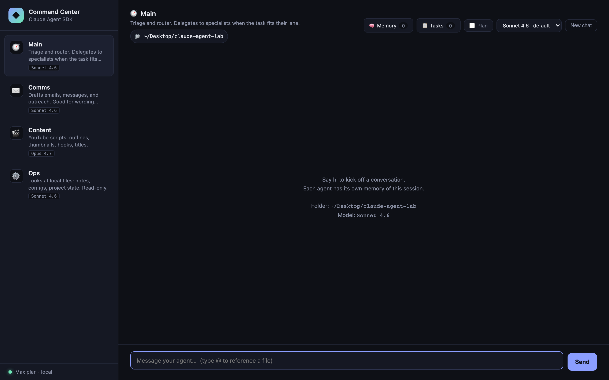

> **This is an educational reference, not a product.** It is designed to be studied, forked, and modified locally. You supply your own Anthropic credentials. There is no hosted version and none is planned. See the [Authentication](#authentication) section for the ToS caveat on claude.ai OAuth and third-party products.

---

## Why this exists

A YouTuber demonstrated a "command center" agent dashboard built on an open-source multi-provider agent CLI, and casually mentioned it took ~6–7 weeks. I wanted to see how much of that is the engine work that the official Claude Agent SDK now hands you for free, and how much is the actual product work that still stands on its own.

The answer: when Claude is the target model, the SDK collapses the engine layer to a function call. Command Center exists as a concrete, readable example of how thin that layer can be — and a sandbox to explore what the SDK makes easy that used to be hard.

If you need multi-provider (OpenAI / Ollama / OpenRouter / local), this isn't the right starting point — look at [OpenCode](https://github.com/sst/opencode), which provides a provider abstraction that the Agent SDK deliberately does not.

---

## Features at a glance

Each feature maps to **one or two options** on the SDK's `query()` call. Reading the source is reading the SDK's surface area.

| Feature | SDK primitive |
|---|---|
| [Multi-agent sidebar](#multi-agent-sidebar) | `systemPrompt`, `allowedTools` per call |
| [Sub-agent delegation](#sub-agent-delegation) | `agents: Record<string, AgentDefinition>` + `Agent` tool |
| [Token-by-token streaming](#token-by-token-streaming) | `includePartialMessages: true` → `stream_event` messages |
| [Folder scoping](#folder-scoping) | `cwd` |
| [Per-agent model selection](#per-agent-model-selection) | `model: "claude-opus-4-7" \| "claude-sonnet-4-6" \| "claude-haiku-4-5"` |
| [Task queue with auto-routing](#task-queue-with-auto-routing) | One-shot Haiku `query()` as a classifier |
| [Markdown rendering](#markdown-rendering) | Not SDK — `marked` + `DOMPurify` + `highlight.js` on completed replies |
| [Persistent memory (SQLite)](#persistent-memory-sqlite) | Injected into `systemPrompt` on every call |
| [Slash commands](#slash-commands) | Client-side interception before POST |
| [Plan mode toggle](#plan-mode-toggle) | `permissionMode: 'plan'` |
| [File checkpointing](#file-checkpointing) | `enableFileCheckpointing: true` (snapshots enabled; UI rewind pending) |
| [Abort on client disconnect](#abort-on-client-disconnect) | `abortController: AbortController` |
| [Multi-turn per agent](#multi-turn-per-agent) | `resume: sessionId` captured from `system.init` |
| [`@file` autocomplete](#file-autocomplete) | Not SDK — plain filesystem read + UI glue |

---

### Multi-agent sidebar

Four agents, each defined by a ~20-line object in [`src/agents.ts`](src/agents.ts): `systemPrompt`, `allowedTools`, `model`, and a bit of UI metadata (emoji, accent color). Click an agent → chat with them. Each agent keeps its own conversation.

- **🧭 Main** — triage + router, no direct tools
- **✉️ Comms** — drafts messages, `WebFetch`
- **🎬 Content** — YouTube / long-form writing, `WebSearch` + `WebFetch`, **Opus 4.7** (creative work gets the best model)
- **⚙️ Ops** — reads local files in the selected folder, `Read` / `Glob` / `Grep`, read-only

Adding a fifth is one object in `agents.ts` — no server changes needed.

---

### Sub-agent delegation

Promote an agent to a "router" by giving it `Agent` in its `allowedTools` and populating `options.agents` with `AgentDefinition` objects for the specialists. It gains the ability to invoke any named sub-agent as a tool.

Ask Main "draft a short email thanking a client" → Main recognizes this as Comms's lane → invokes Comms as a sub-agent → the reply threads back with a "🤝 delegated to ✉️ Comms" chip.

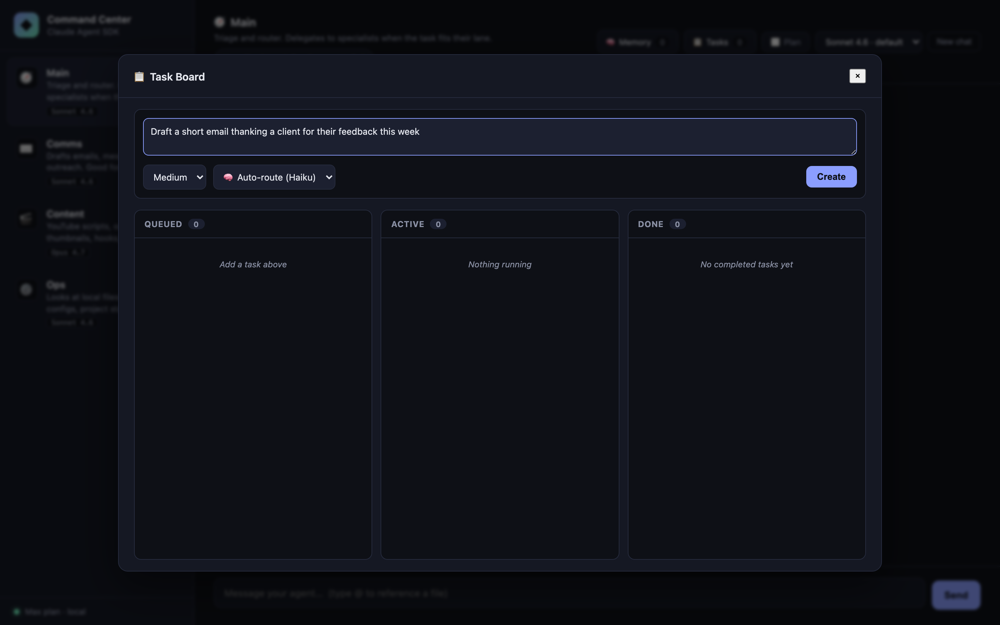

The whole routing decision is handled by the model. There is zero manual "which agent should this go to?" code in the server — just the `agents` option and an `Agent` entry in `allowedTools`.

---

### Token-by-token streaming

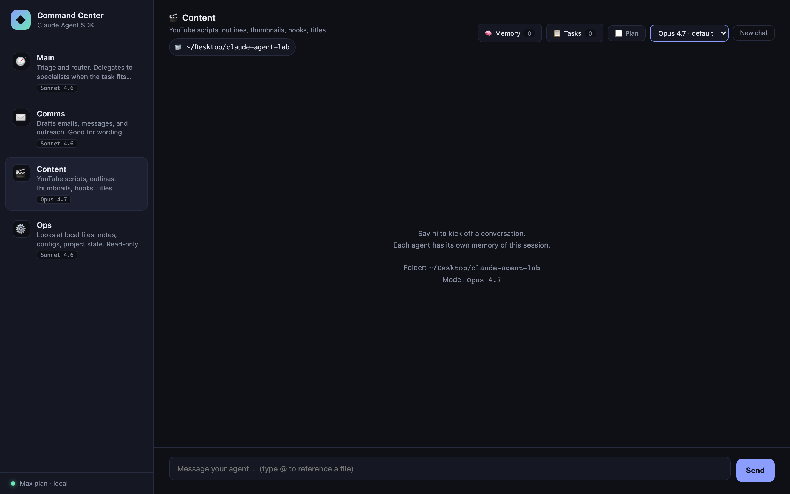

`POST /api/chat/stream` returns [NDJSON](https://github.com/ndjson/ndjson-spec) (one JSON object per line). With `includePartialMessages: true`, the SDK emits `stream_event` messages whose `event.delta.text` carries the incremental text. The server forwards them to the frontend, which appends to a live-updating chat bubble with a blinking cursor.

Why NDJSON instead of Server-Sent Events? `EventSource` can't POST, and we want the client to start the connection with a request body. NDJSON over `fetch().body.getReader()` is simpler, works anywhere, and doesn't need the browser's SSE state machine.

---

### Folder scoping

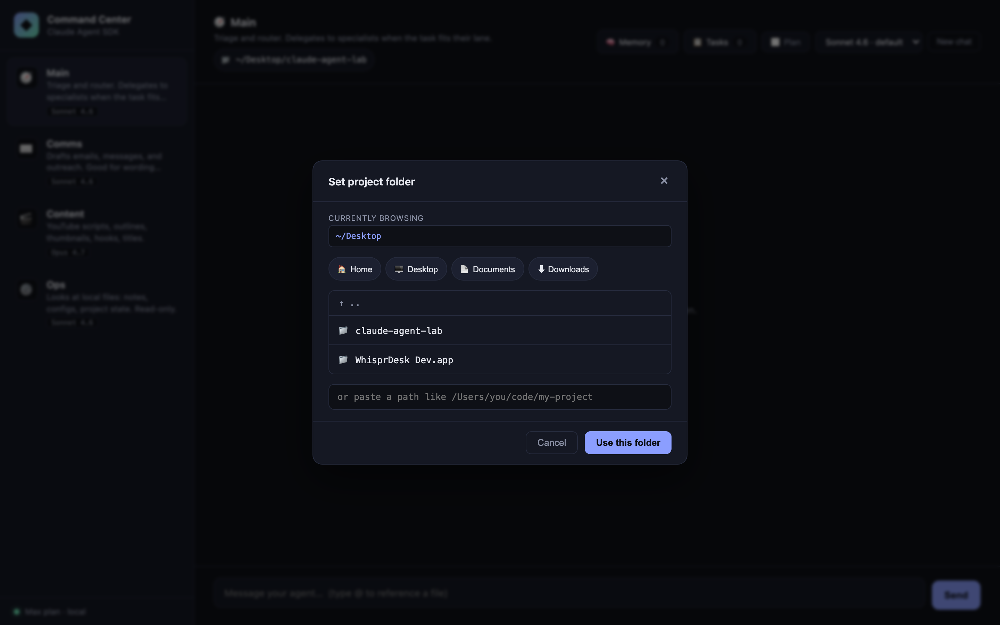

One SDK option — `cwd` — and every agent runs scoped to the folder you pick. Ops's `Read/Glob/Grep` tools operate inside that folder. The classifier and other agents get folder context in their turn history.

Click the `📁` pill in the chat header to open the picker. Browse, drill down, or paste a path. Quick-preset buttons for Home / Desktop / Documents / Downloads. Changing folder clears all sessions (the old cwd would stale any resumed conversation).

---

### Per-agent model selection

Each agent has a **default model** in `agents.ts`. The header `<select>` overrides it per-agent at runtime. The reply's footer shows exactly which model answered (`🧠 Sonnet 4.6`) and how it authenticated (`🔐 Max plan · subscription` for OAuth, or `🔑 API key (...)` for a key).

Switching models clears that agent's session — the new model starts with a fresh context, not a context primed for the old one.

---

### Task queue with auto-routing

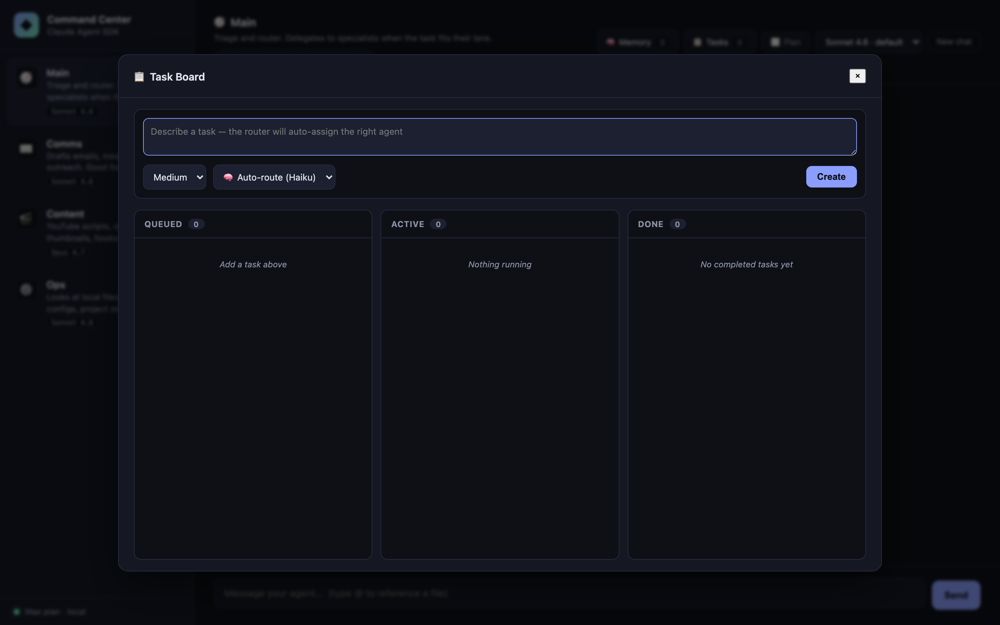

Click **Tasks** in the header. Describe a task, set priority, hit **Create**. A one-shot Haiku query (~1s, ~$0.0001) classifies the task to the best agent. The task lands in *Queued*; click *Run* to fire it. Tasks run with a fresh context (no session resume) so they don't pollute an ongoing chat.

Auto-routing accepts an optional `agentId` override if you'd rather pick the specialist yourself.

**Why Haiku for classification?** It's fast, cheap, and the task is well-bounded. The main-thread agents use Sonnet or Opus; Haiku handles the decisions about where to send the work.

---

### `@file` autocomplete

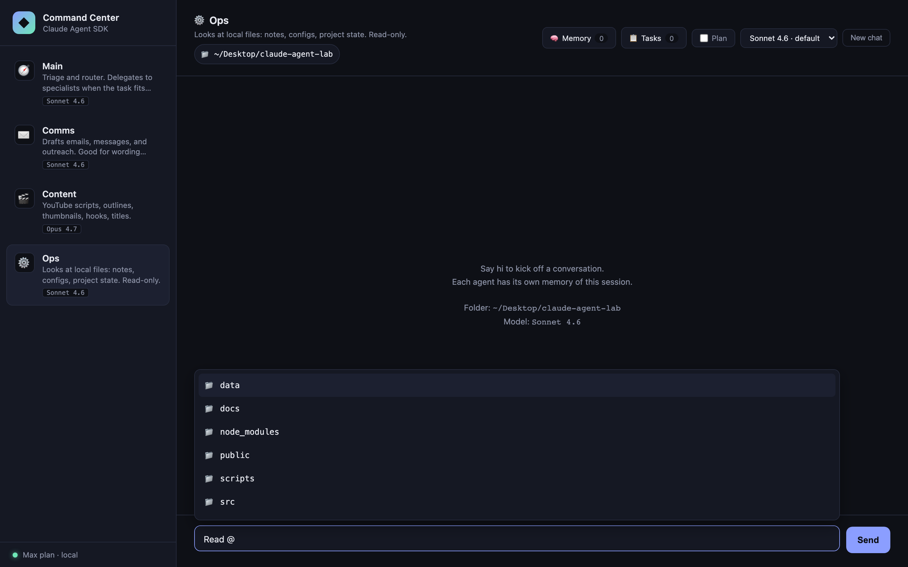

Type `@` in the composer. A dropdown appears with files in the current `cwd`, filterable, keyboard-navigable (↑/↓, Enter, Esc). Selecting inserts `` `filename` `` into the prompt, which Ops (with `Read` in its allowlist) will then open.

Not an SDK feature — just `fs.readdir` on the server and a tiny popover in `public/app.js`. Included to show how naturally the SDK composes with normal web UI plumbing.

---

### Markdown rendering

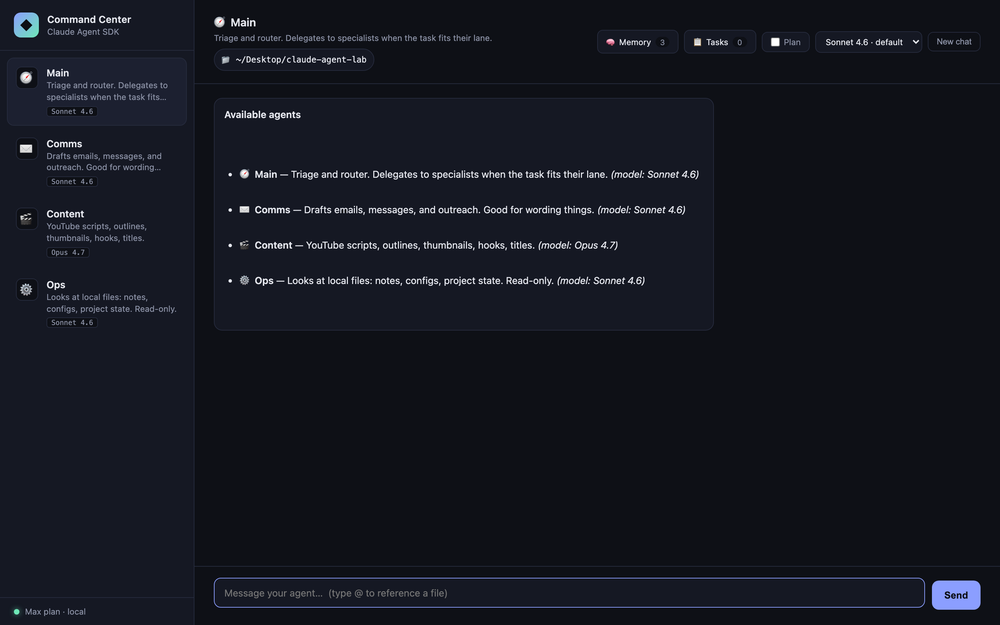

Agent replies are rendered as **sanitized markdown** once streaming completes — bold/italic, lists, tables, syntax-highlighted code blocks, blockquotes, links (external links open in a new tab). During live streaming the bubble stays plain text to avoid parsing markdown on every delta; on `done` we swap in the markdown HTML.

Three libraries, all via jsDelivr CDN so there's no build step:
- [`marked`](https://marked.js.org) — parser
- [`DOMPurify`](https://github.com/cure53/DOMPurify) — sanitizer (prevents XSS from any HTML the model emits)
- [`highlight.js`](https://highlightjs.org) — code block syntax highlighting (github-dark theme)

User messages stay plain text. System-origin messages (slash-command output, memory injections) use the same renderer for parity.

---

### Persistent memory (SQLite)

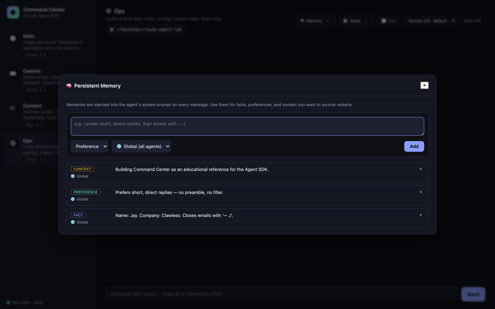

Facts, preferences, and context that should survive restarts. Stored in `./data/lab.db` (gitignored) via [`better-sqlite3`](https://github.com/WiseLibs/better-sqlite3). Memories can be:

- **Global** (all agents) or **scoped to one agent**
- Categorized as `fact`, `preference`, or `context`
- Added from the Memory panel (header button) or via API

On every `query()` call the server pulls memories relevant to the active agent and appends them to the system prompt as a `<persistent-memory>` block, capped at ~2,000 characters to stay in budget. Specialist and router agents both see them.

```
<persistent-memory>
Preferences:
- Prefers short, direct replies — no preamble, no filler.
Facts:
- Name: Jay. Company: Clawless. Closes emails with '— J'.
Context:
- Building Command Center as an educational reference for the Agent SDK.
</persistent-memory>
```

---

### Slash commands

Type `/` as the first character and the client-side dispatcher handles it without a server round-trip:

| Command | Effect |
|---|---|
| `/help` | List all commands |
| `/clear` | New conversation with this agent (same as header button) |
| `/model` | Show current model + available options |
| `/model <id>` | Switch model for this agent. Aliases: `opus`, `sonnet`, `haiku` |
| `/agents` | List all agents with their descriptions and default models |
| `/plan on\|off` | Toggle plan mode for this agent |

Output renders as a system-origin message in the chat log with full markdown formatting.

---

### Plan mode toggle

A checkbox in the header flips the active agent into the SDK's `permissionMode: 'plan'` — tool calls are **classified as they'd run but not actually executed**. Great for exploring what Ops *would* do before letting it do it. Also useful as a destructive-action safety net: enable plan on Content or Ops, ask the hard question, read the plan, then disable plan and rerun if the plan looks right.

Per-agent state. Switching plan mode clears that agent's session (the SDK treats plan vs. execute as different context semantics).

---

### File checkpointing

`enableFileCheckpointing: true` is set on every `query()` call. The SDK now **snapshots files before any Edit/Write** so they can be restored. The UI "roll back to this turn" affordance is on the backlog — the snapshot infrastructure is already live as of this version, so when rewind ships you'll be able to rewind turns that happened today.

---

### Abort on client disconnect

If you reload the browser mid-reply, the server aborts the `query()` via `AbortController` instead of letting the SDK keep streaming into a dead socket. The trick is listening on `res.on("close")` — **not** `req.on("close")`, which fires as soon as `express.json()` finishes consuming the request body. Documented in [`docs/case-studies/building-with-ai-agents.md`](docs/case-studies/building-with-ai-agents.md) because it's a subtle gotcha.

### Multi-turn per agent

Each agent has its own `sessionId` captured from the SDK's `system.init` message. Subsequent messages pass `resume: sessionId`, giving the SDK the full prior conversation. Hit the *New chat* button to drop that session and start fresh.

---

## Quick start

```bash
git clone https://github.com/jaysidd/claude-agent-lab.git
cd claude-agent-lab
npm install

# Option A — API key (recommended; works as a daily driver)
cp .env.example .env
# edit .env and paste your key from https://console.anthropic.com/settings/keys

# Option B — your local Claude Code CLI login (personal tinkering only)
# Nothing to configure; just ensure `claude` is installed and logged in.
# See Authentication section for the ToS caveat.

npm run serve
```

Then open [http://localhost:3333](http://localhost:3333). The server binds to `127.0.0.1` only — it does **not** listen on your LAN.

### Requirements
- **Node.js 20+** (tested on 24.14.1)
- **One** of:
  - An Anthropic API key from [console.anthropic.com](https://console.anthropic.com)
  - A logged-in [Claude Code CLI](https://code.claude.com/docs/en/setup) (`claude` binary) — for personal use on your own machine

---

## Architecture

### System topology

```
Browser (vanilla JS)  →  Express server (:3333)  →  Claude Agent SDK  →  Claude Code CLI
      │                        │                          │                    │
      │                 /api/* routes                query({...})        OAuth session
      │                        │                          │                (or API key)
      │                 in-memory state              Anthropic
      │                 (sessions, cwd,
      │                  tasks, overrides)
```

**One process, one port.** No Electron, no IPC bridge, no separate renderer build. `tsx` runs TypeScript directly. Static files serve from `/public`.

**State** is in-memory (restart = fresh). Persistent storage is on the backlog ([`C04`](backlog.md)).

| Map | Type | Purpose | Resets on |
|---|---|---|---|
| `sessionByAgent` | `Map<agentId, sessionId>` | SDK session id for `resume:` | reset, cwd change, model override |
| `modelOverride` | `Map<agentId, string>` | per-agent model choice vs default | POST `/api/model/:agentId` with empty body |
| `tasks` | `Map<taskId, Task>` | task board state | per-id DELETE; capped at 50 completed |
| `currentCwd` | `string` | folder passed as `cwd` to every `query()` | POST `/api/cwd` |

Full design notes in [`architecture.md`](architecture.md).

---

## Technical details

### Authentication resolution

The SDK picks credentials in strict order. First match wins.


In this repo: `ANTHROPIC_API_KEY` empty by default → OAuth path → `apiKeySource === "none"` on the response → UI labels it "🔐 Max plan · subscription".

---

### Simple chat request (buffered, `/api/chat`)

Used by the non-streaming fallback and the Playwright test suite.

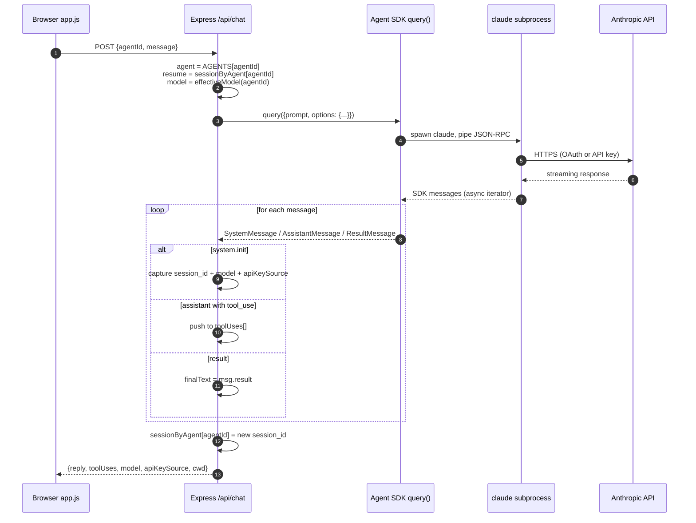

---

### Streaming chat (`/api/chat/stream`)

With `includePartialMessages: true`, the SDK emits `SDKPartialAssistantMessage` events (`type: "stream_event"`) that wrap Anthropic's raw `BetaRawMessageStreamEvent`. The server unwraps `content_block_delta` events and forwards text deltas as NDJSON.

```mermaid
sequenceDiagram
  autonumber
  participant UI as app.js
  participant Srv as /api/chat/stream
  participant SDK as query()
  Note over UI,Srv: POST body: {agentId, message}
  UI->>Srv: fetch()
  Srv-->>UI: headers sent,<br/>Content-Type: application/x-ndjson
  Srv->>SDK: query({includePartialMessages: true, abortController, ...})
  loop SDK message stream
    SDK-->>Srv: system.init
    Srv-->>UI: {"kind":"init","sessionId","model","apiKeySource"}
    SDK-->>Srv: stream_event (content_block_delta)
    Srv-->>UI: {"kind":"text_delta","text":"..."}
    SDK-->>Srv: assistant (tool_use block)
    Srv-->>UI: {"kind":"tool_use","name","input"}
    SDK-->>Srv: result
    Srv-->>UI: {"kind":"result","text":"..."}
  end
  Srv-->>UI: {"kind":"done"}
  Note over UI,Srv: res.end(); socket closes normally

  Note over UI,Srv: If client disconnects:<br/>res.on("close") fires →<br/>abortController.abort() →<br/>SDK iterator stops
```

**Wire shape** (real sample):
```
{"kind":"init","sessionId":"3cf37180-...","model":"claude-opus-4-7","apiKeySource":"none"}
{"kind":"text_delta","text":"Here are 3 You"}
{"kind":"text_delta","text":"Tube title ideas:\n\n1. I Built an AI Agent in "}
{"kind":"text_delta","text":"10 Minutes\n2. Claude Agent SDK: The Missing Begin"}
{"kind":"text_delta","text":"ner's Guide\n3. Why Developers Are Switching..."}
{"kind":"result","text":"Here are 3 YouTube title ideas:\n\n1. ..."}
{"kind":"done"}
```

---

### Sub-agent delegation (`Main → Comms/Content/Ops`)

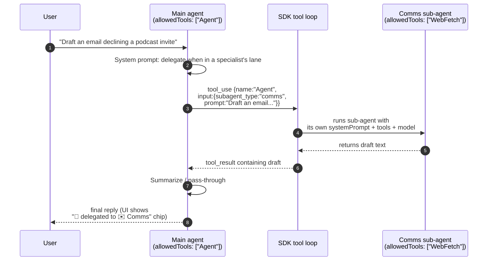

**Key property:** sub-agents run with **their own** `allowedTools`, not the router's. Delegation cannot escalate tool access — Main's empty-tool-set doesn't leak into Comms, and Comms's `WebFetch` doesn't leak out to Main.

---

### Task queue + classification flow

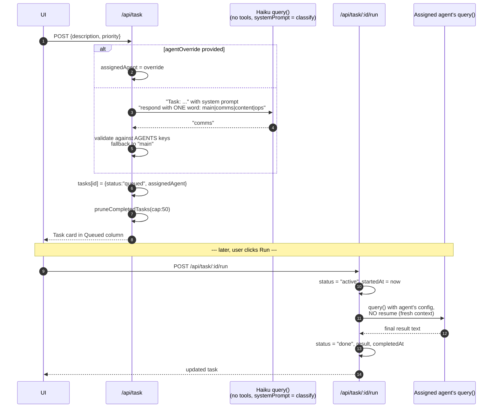

---

### Task state machine

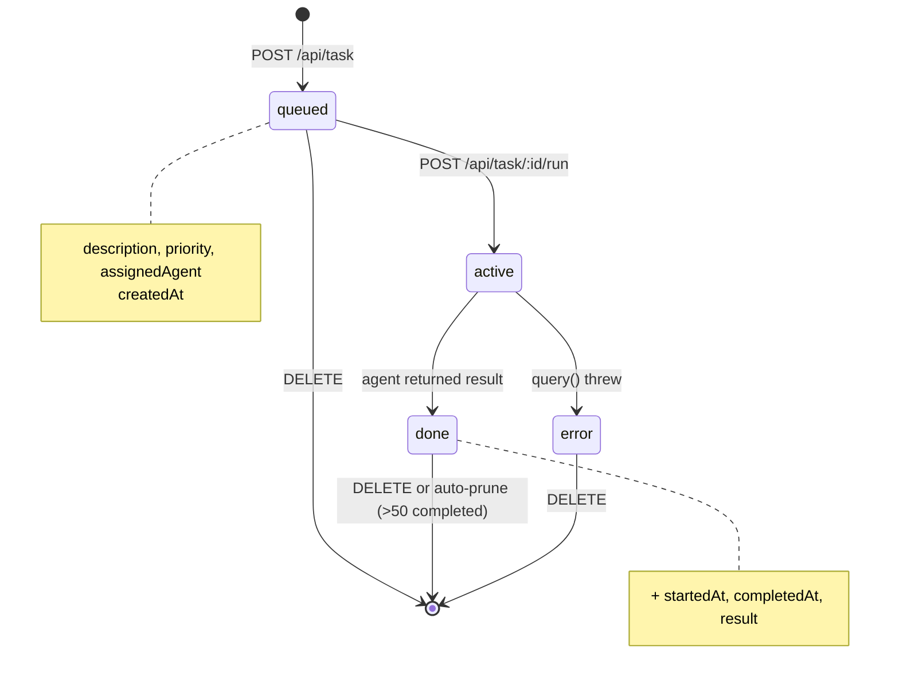

---

### Frontend data flow (streaming path)


**Why the direct-write optimization matters:** `renderMessages()` rebuilds the entire chat log on each call. For a 2000-token Sonnet reply streamed as ~200 deltas, re-rendering per delta was O(turns × deltas) main-thread work (~2–5 ms per delta, compounding). By caching the streaming bubble's body element and mutating `textContent` directly, per-delta cost drops to sub-millisecond. [Performance audit details](docs/audits/perf-audit-2026-04-23.md).

---

### Security-relevant defaults

- **Binds to `127.0.0.1`** — never `0.0.0.0`. LAN neighbors cannot reach the server. Override with `HOST=...` only if you know what you're doing.
- **All user-controlled strings go through `textContent`** — no `innerHTML` interpolation anywhere in `public/app.js`.
- **Classifier output is whitelisted** against known agent ids before use; never string-interpolated into tool arguments.
- **Sub-agent delegation cannot escalate tool access** — each sub-agent runs with its own `allowedTools`.
- **Path traversal on `/api/cwd` / `/api/browse` is intentionally unrestricted** for the personal-use threat profile (user can reach anywhere on their own laptop anyway). **This becomes a BLOCKER the moment a multi-user or commercial path is introduced** — see the [security audit](docs/audits/security-audit-2026-04-23.md).

---

### API contract

| Route | Method | Request | Response |
|---|---|---|---|
| `/api/agents` | GET | — | `Array<{id, name, emoji, accent, description, model, defaultModel}>` |
| `/api/models` | GET | — | `Array<{id, label, blurb}>` |
| `/api/model/:agentId` | POST | `{model?: string}` | `{agentId, model}` (empty body = reset) |
| `/api/cwd` | GET | — | `{cwd, home}` |
| `/api/cwd` | POST | `{path}` | `{cwd}` |
| `/api/browse` | GET | `?path=...` | `{path, parent, dirs[]}` |
| `/api/files` | GET | `?q=...` | `{files: Array<{name, isDir}>}` |
| `/api/chat` | POST | `{agentId, message}` | `{reply, toolUses, cwd, model, apiKeySource}` |
| `/api/chat/stream` | POST | `{agentId, message}` | NDJSON (see wire shape above) |
| `/api/reset/:agentId` | POST | — | `{ok}` |
| `/api/memories` | GET | `?agentId=` | `Array<Memory>` (global + matching agent if provided) |
| `/api/memories` | POST | `{content, agentId?, category?}` | `Memory` |
| `/api/memories/:id` | DELETE | — | `{ok}` |
| `/api/memories` | DELETE | — | `{ok, cleared}` (wipes all memories) |
| `/api/plan/:agentId` | GET | — | `{agentId, enabled}` |
| `/api/plan/:agentId` | POST | `{enabled: boolean}` | `{agentId, enabled}` |
| `/api/tasks` | GET | — | `Array<Task>` |
| `/api/task` | POST | `{description, priority?, agentId?}` | `Task` |
| `/api/task/:id/run` | POST | — | `Task` (updated) |
| `/api/task/:id` | DELETE | — | `{ok}` |

---

## Project layout

```
claude-agent-lab/
├── src/
│   ├── server.ts        # Express + SDK glue (~300 LOC). All /api/* routes.
│   ├── agents.ts        # Four agent configs + sub-agent helper (~120 LOC)
│   └── hello.ts         # 15-line URL-summarizer smoke test
├── public/
│   ├── index.html       # UI markup
│   ├── style.css        # Dark command-center theme
│   └── app.js           # Vanilla-JS frontend (~620 LOC) — no framework
├── tests/
│   ├── smoke.spec.ts    # 7 offline Playwright tests
│   └── chat.spec.ts     # 2 @engine tests that hit the real SDK
├── docs/
│   ├── case-studies/    # What-we-learned-while-building notes
│   ├── audits/          # Performance + Security audit reports
│   ├── drafts/          # LinkedIn drafts (personal blog pipeline)
│   └── screenshots/     # The images used in this README
├── scripts/
│   └── screenshot.mjs   # Playwright script that captures the README images
├── CLAUDE.md            # Project conventions (six-role dev team, etc.)
├── architecture.md      # Technical architecture
├── backlog.md           # Sequential feature backlog (C##)
└── handoff.md           # Session-to-session notes
```

---

## Scripts

```bash
npm run serve        # start the server (also `npm start`)
npm run hello        # original URL-summarizer smoke test
npm run test:smoke   # 7 offline UI tests (no SDK calls, ~2 seconds)
npm run test:engine  # 2 end-to-end tests against the real SDK (~15 seconds)
npm test             # all tests

node scripts/screenshot.mjs   # regenerate the README screenshots (needs server running)
```

---

## Authentication

The Agent SDK resolves credentials in this order:

1. **`ANTHROPIC_API_KEY`** env var — if set, used unconditionally
2. **Enterprise transports** — `CLAUDE_CODE_USE_BEDROCK=1`, `CLAUDE_CODE_USE_VERTEX=1`, or `CLAUDE_CODE_USE_FOUNDRY=1` with the corresponding cloud credentials
3. **Your local Claude Code CLI's OAuth session** — only if none of the above are set

If you're using this lab for your own personal learning on your own laptop and already have Claude Code installed, option 3 works automatically. The SDK inherits your CLI session the same way `claude` itself does.

**If you're reading this to understand what to do for a shippable product:** do not use option 3. Anthropic's [Agent SDK docs](https://code.claude.com/docs/en/agent-sdk/overview) are explicit:

> Unless previously approved, Anthropic does not allow third party developers to offer claude.ai login or rate limits for their products, including agents built on the Claude Agent SDK. Please use the API key authentication methods described in this document instead.

This repo is **not** a product. If you turn it into one, switch to API keys and surface a BYO-key UI for your users.

---

## What's on the backlog

The current implementation covers F1–F7 foundation + C01–C11 and partial C12 (checkpointing infra). See [`backlog.md`](backlog.md) for the full sequential list. Top candidates for the next sessions:

- **File rewind UI** (C12 completion) — the `enableFileCheckpointing: true` infrastructure is already live; what's missing is persisting the Query object across requests via streaming-input mode so `rewindFiles(userMessageId)` can be called on-demand. Needs a session-model refactor.
- **Cost & token tracking** — read usage from the SDK's `ResultMessage` and surface per-turn + session-total token/cost.
- **Telegram / Discord bridge** — same engine, additional interface; pairs with slash commands already in place.
- **Session history sidebar** — persist conversations across restarts (memory exists, chats don't yet).
- **AskUserQuestion inline UI** — surface the SDK's built-in tool for mid-turn clarification as an interactive card.
- **MCP configuration UI** — point at an external MCP server and have its tools light up for a chosen agent.

Ideas worth reading about that landed in the "Future — not scheduled" list: voice I/O (Pipecat / Gemini Live), "council mode" (multi-agent debate + synthesizer), multi-pane chat, hook inspector, keyboard shortcuts, onboarding tour.

---

## What this is not

- **Not a product.** No service, no accounts, no billing, no hosted version.
- **Not multi-provider.** Claude only. For OpenAI / Ollama / OpenRouter / local models, use [OpenCode](https://github.com/sst/opencode).
- **Not for anyone else's Max plan.** If you want to build a Max-plan-powered app for other people, you can't — see [Authentication](#authentication).

---

## Contributing

Issues and PRs welcome if you're using this as a learning reference and want to contribute improvements.

That said: **this project deliberately stays small.** Features that require new runtime dependencies, a framework, or a multi-provider abstraction will likely be declined with a "this belongs in a different project" note. The point is to be readable end-to-end in an afternoon.

The six-role dev-team convention the repo uses (Architect → Developer → Reviewer → QA → Performance Analyst → Security Analyst) is documented in [`CLAUDE.md`](CLAUDE.md). You don't need to follow it to contribute, but PRs that include a brief "Reviewer checklist" in the description tend to merge faster.

---

## Acknowledgements

- **Anthropic** for the [Claude Agent SDK](https://code.claude.com/docs/en/agent-sdk/overview) and for making `@anthropic-ai/claude-agent-sdk` open and approachable.
- The YouTuber who demonstrated a command-center pattern on top of OpenCode and got me thinking about how thin this layer could actually be when Claude is the target model.
- [OpenCode](https://github.com/sst/opencode) for being the right answer to "what if I need multi-provider?"

---

## License

[MIT](LICENSE) — use it, fork it, study it, teach from it. If you ship a commercial derivative, remember the Authentication caveat above.
