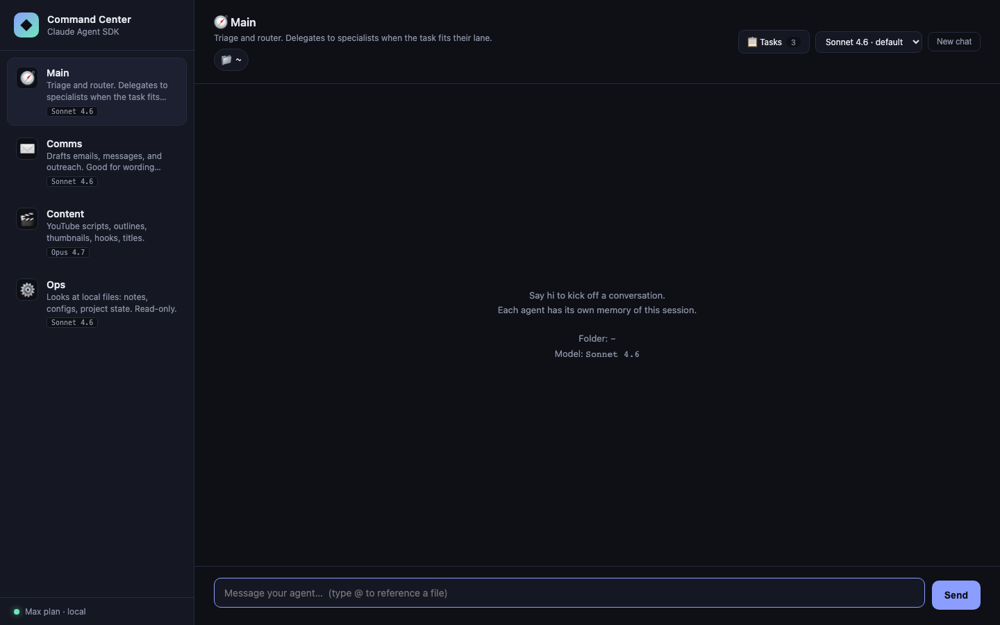

# Command Center — a Claude Agent SDK learning lab

A small, hackable multi-agent dashboard built directly on Anthropic's official [Claude Agent SDK](https://code.claude.com/docs/en/agent-sdk/overview). Four specialized agents in a browser UI: a router that delegates to specialists, a drafter for messages, a creative for content, and a read-only file analyst scoped to a folder you pick.



> **This is an educational reference, not a product.** It is designed to be studied, forked, and modified locally. You supply your own Anthropic credentials. There is no hosted version and none is planned.

## What it demonstrates

Each feature maps to exactly one or two options on the SDK's `query()` call. Reading the source is reading the SDK's surface area:

| Feature | SDK option |
|---|---|
| Per-agent personality + tool allowlist | `systemPrompt`, `allowedTools` |
| Multi-turn conversation per agent | `resume` (session id captured from the init message) |
| Router → specialist delegation | `agents` (map of `AgentDefinition`) + `Agent` in `allowedTools` |
| Token-by-token streaming | `includePartialMessages: true` + iterating `stream_event` messages |
| Folder scoping (Read / Glob / Grep) | `cwd` |
| Per-agent model selection (Opus / Sonnet / Haiku) | `model` |
| Abort on client disconnect | `abortController` |

That's the whole trick. The rest is Express plumbing and ~370 lines of vanilla JS for the UI.

## Requirements

- Node.js 20+
- An Anthropic account with **one** of:
  - An API key from [console.anthropic.com](https://console.anthropic.com) — pay-as-you-go, recommended
  - A locally-logged-in [Claude Code CLI](https://code.claude.com/docs/en/setup) (`claude` binary) — the SDK will inherit that OAuth session if `ANTHROPIC_API_KEY` is not set

## Quick start

```bash
git clone <your-fork-url> command-center
cd command-center
npm install

# Option A — bring your API key (recommended)
cp .env.example .env
# edit .env and paste your key

# Option B — use your local Claude Code CLI login (see Authentication below)
# (nothing to configure; just make sure `claude` is installed and logged in)

npm run serve
open http://localhost:3333
```

Server binds to `127.0.0.1` only. It does not listen on your LAN.

## Authentication

The SDK resolves credentials in this order:

1. `ANTHROPIC_API_KEY` environment variable — if set, used unconditionally
2. Amazon Bedrock / Google Vertex / Azure Foundry env flags — enterprise paths
3. The Claude Code CLI's OAuth session at `~/.claude/` — only if none of the above

**If you're using this lab for your own personal learning on your own laptop and you already have Claude Code installed, option 3 works automatically.** The SDK inherits your CLI session the same way `claude` itself does.

**If you're reading this to understand what to do for a shippable product**: do not use option 3. Anthropic's [Agent SDK docs](https://code.claude.com/docs/en/agent-sdk/overview) are explicit:

> Unless previously approved, Anthropic does not allow third party developers to offer claude.ai login or rate limits for their products, including agents built on the Claude Agent SDK. Please use the API key authentication methods described in this document instead.

This repo is not a product. If you turn it into one, switch to API keys.

## What's inside

```
command-center/
├── src/
│   ├── server.ts     # Express + SDK glue (~300 LOC). All /api/* routes.
│   ├── agents.ts     # Four agent configs + sub-agent helper (~120 LOC)
│   └── hello.ts      # 15-line URL-summarizer smoke test
├── public/
│   ├── index.html    # UI markup
│   ├── style.css     # Dark command-center theme
│   └── app.js        # Vanilla-JS frontend (~620 LOC) — no framework
├── tests/
│   ├── smoke.spec.ts    # 7 offline Playwright tests
│   └── chat.spec.ts     # 2 real-SDK (@engine) tests
├── docs/
│   ├── case-studies/    # What-we-learned-while-building notes
│   ├── audits/          # Performance + Security audit reports
│   └── drafts/          # LinkedIn post drafts (personal blog pipeline)
├── CLAUDE.md         # Project conventions (six-role dev team, etc.)
├── architecture.md   # Technical architecture + design decisions
├── backlog.md        # Sequential feature backlog (C##)
└── handoff.md        # Session-to-session notes
```

## Scripts

```bash
npm run serve        # start the server (also `npm start`)
npm run hello        # the original URL-summarizer smoke test
npm run test:smoke   # 7 offline UI tests (no SDK calls)
npm run test:engine  # 2 end-to-end tests that hit the real SDK
npm test             # all tests
```

## What's on the backlog

See `backlog.md`. Highlights:
- Markdown rendering + syntax highlighting in chat
- Persistent memory (SQLite)
- Slash commands (`/clear`, `/model`, `/agents`)
- Plan mode toggle (SDK's `permissionMode: 'plan'`)
- File rewind via `Query.rewindFiles()`
- Cost & token tracking
- Telegram / Discord bridge
- Markdown + multi-pane chat ("mission control" split view)

## What this is not

- **Not a product.** No service, no hosting, no accounts, no billing.
- **Not multi-provider.** Claude only. If you need OpenAI / OpenRouter / Ollama, look at open-source agent CLIs like [OpenCode](https://github.com/sst/opencode) that provide a provider abstraction layer.
- **Not for anyone else's Max plan.** If you want to build a Max-plan-powered app for other people, you can't — see the Authentication note above.

## Contributing

Issues and PRs are welcome if you're using this as a learning reference and want to contribute improvements. But: this project deliberately stays small. Features that require new runtime dependencies, frameworks, or a multi-provider abstraction will likely be declined with a "this belongs in a different project" note.

## Acknowledgements

- Anthropic for the [Claude Agent SDK](https://code.claude.com/docs/en/agent-sdk/overview)
- The YouTuber who demonstrated a command-center pattern on top of OpenCode and got me thinking about how thin this layer could be

## License

[MIT](LICENSE)
